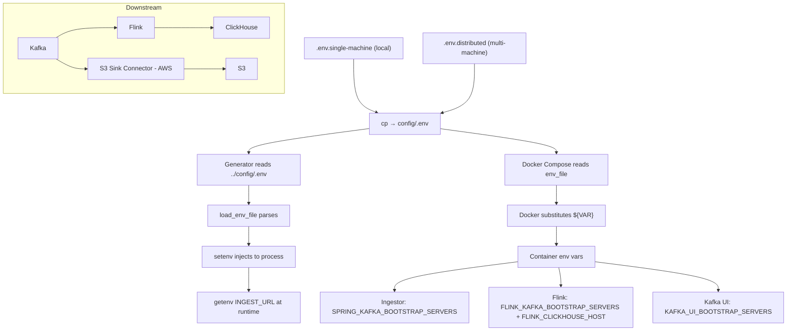

# Environment-Based Deployment Configuration System

## Role
Enable two deployment topologies (single-machine vs 9-machine distributed) for the full pipeline from a single codebase using file-based environment variable templates.

**Pipeline:**
```
generator → nginx → ingestor (×3) → kafka (×3) ─┬─→ s3 sink connector → S3 (AWS)
                                                  └─→ flink → clickhouse
```

## I/O Flow
```
[config/.env.single-machine OR config/.env.distributed]
                    |
                    | manual cp → config/.env
                    ↓
             [config/.env] --(Parse)--> [Runtime Components]
                                        ├─ Generator      (C++ setenv)
                                        ├─ Ingestors      (Docker env_file)
                                        ├─ Kafka          (Docker env_file)
                                        ├─ Nginx          (Docker env_file)
                                        ├─ Flink          (Docker env_file)
                                        ├─ ClickHouse     (self-contained, no env_file)
                                        └─ S3 Connector   (AWS Kafka Connect, no env_file)
```

## Implementation Logic

### Data Flow


### Concurrency Model
- **Thread Model:** N/A (Configuration loading only)
- **Shared State:** File system (.env file) - read-only after copy
- **Sync Primitives:** None required
- **Mutability:** Immutable after process startup
  - Generator: Loads once at main() entry via load_env_file()
  - Docker: Reads once at container creation
  - Changes require restart

### Core Algorithm

#### 1. Template Copy (manual)
```bash
# Local pipeline
cp config/.env.single-machine config/.env

# Distributed pipeline
cp config/.env.distributed config/.env
# Then: edit IPs in Instance Registry + derived vars + nginx.distributed.conf
```

#### 2. Generator Parsing (generate.cpp:294-321)
```cpp
load_env_file("../config/.env");  // Relative to generator/ CWD
  ↓ For each line:
  ↓   Skip if empty or starts with '#'
  ↓   Parse KEY=VALUE
  ↓   Strip quotes from VALUE
  ↓   setenv(KEY, VALUE, 0)  // 0 = don't overwrite existing
```
**Priority:** Shell env > .env file > Application defaults

Key usage:
- `INGEST_URL` → HTTP endpoint for sending events (generate.cpp:331, 392)

#### 3. Docker Env File Loading
```yaml
services:
  ingestor-1:
    env_file: ../config/.env
    environment:
      SPRING_KAFKA_BOOTSTRAP_SERVERS: ${SPRING_KAFKA_BOOTSTRAP_SERVERS}
```
**Mechanism:**
1. Docker reads `../config/.env` before container start
2. Substitutes `${VAR}` placeholders in `environment:` section
3. Passes final values as container environment variables

Key variables consumed:
- `SPRING_KAFKA_BOOTSTRAP_SERVERS` → Kafka broker addresses (Ingestors, distributed mode)
- `KAFKA_ADVERTISED_LISTENERS_*` → Per-broker external/internal listeners (forward-looking)
- `NGINX_LB_PORT`, `INGESTOR_*_PORT` → Port mappings
- `FLINK_KAFKA_BOOTSTRAP_SERVERS`, `FLINK_CLICKHOUSE_*` → Flink connections
- `KAFKA_UI_PORT`, `KAFKA_UI_BOOTSTRAP_SERVERS` → Kafka UI

## Data Contract

### Input Format (.env files)
```bash
# Comments allowed (must be on their own line -- no inline comments)
KEY=VALUE
KEY_WITH_QUOTES="value with spaces"  # Quotes stripped by generator parser
KEY_NUMERIC=8080
KEY_LIST=server1:9092,server2:9092   # Application parses the list
```
**Important:** The C++ parser does NOT support `${VAR}` expansion or inline comments after values. All values must be written literally.

### Instance Registry (distributed only)
The top section of `.env.distributed` is the single source of truth for IPs. Per-component docker-compose files derive their connection strings from these IPs automatically via Docker Compose `${VAR}` substitution in their `environment:` blocks. Update an IP in the registry and it flows through to all components that reference it — no manual editing of derived values needed.

**Exception:** `ingestor/nginx.distributed.conf` must still be manually edited — Nginx cannot read env vars in `upstream` blocks.

```
GENERATOR_IP    → Machine A (co-located with Nginx)
NGINX_IP        → Machine A
INGESTOR_1_IP   → Machine B
INGESTOR_2_IP   → Machine C
INGESTOR_3_IP   → Machine D
KAFKA_1_IP      → Machine E
KAFKA_2_IP      → Machine F
KAFKA_3_IP      → Machine G
FLINK_IP        → Machine H
CLICKHOUSE_IP   → Machine I
(S3 Connector runs on AWS — no entry)
```

### Configuration Variables

#### Generator
| Variable | V1 (local) | V2 (distributed) | Consumer |
|----------|------------|-------------------|----------|
| `INGEST_URL` | `http://localhost:8080/ingest` | `http://localhost:8080/ingest` | Generator (C++) |

#### Nginx + Ingestor
| Variable | V1 (local) | V2 (distributed) | Consumer |
|----------|------------|-------------------|----------|
| `NGINX_LB_PORT` | `8080` | `8080` | Nginx compose |
| `INGESTOR_PORT` | `8080` | `8080` | Ingestor compose |
| `INGESTOR_1_PORT` | `8081` | `8080` | Ingestor-1 compose |
| `INGESTOR_2_PORT` | `8082` | `8080` | Ingestor-2 compose |
| `INGESTOR_3_PORT` | `8083` | `8080` | Ingestor-3 compose |
| `NGINX_UPSTREAM_1` | `ingestor-1:8080` | — (edit nginx.distributed.conf manually) | Nginx config |
| `NGINX_UPSTREAM_2` | `ingestor-2:8080` | — (edit nginx.distributed.conf manually) | Nginx config |
| `NGINX_UPSTREAM_3` | `ingestor-3:8080` | — (edit nginx.distributed.conf manually) | Nginx config |

#### Kafka
| Variable | V1 (local) | V2 (distributed) | Consumer |
|----------|------------|-------------------|----------|
| `APP_KAFKA_TOPIC` | `taxi-event-data` | `taxi-event-data` | Ingestors (env_file passthrough) |
| `SPRING_KAFKA_BOOTSTRAP_SERVERS` | `kafka-1:29092,...` | derived in docker-compose.ingestor-*.yml from `${KAFKA_*_IP}` | Ingestors |
| `KAFKA_BOOTSTRAP_SERVERS_INTERNAL` | `kafka-1:29092,...` | — | Documentation (V1 only) |
| `KAFKA_BOOTSTRAP_SERVERS_EXTERNAL` | `localhost:9092,9094,9096` | — | S3 connector (AWS) reference (V1 only) |
| `KAFKA_INTERNAL_PORT` | `29092` | `29092` | Kafka compose |
| `KAFKA_CONTROLLER_PORT` | `19093` | `19093` | Kafka compose |
| `KAFKA_ADVERTISED_LISTENERS` | — | derived in docker-compose.kafka-{1,2,3}.yml from `${KAFKA_N_IP}` | Per-broker kafka compose |
| `KAFKA_CONTROLLER_QUORUM_VOTERS` | — | derived in docker-compose.kafka-{1,2,3}.yml from `${KAFKA_*_IP}` | Per-broker kafka compose |
| `KAFKA_UI_PORT` | `8090` | `8090` | Kafka UI compose |
| `KAFKA_UI_BOOTSTRAP_SERVERS` | `kafka-1:29092,...` | derived in docker-compose.kafka-ui.yml from `${KAFKA_*_IP}` | Kafka UI |

#### ClickHouse
| Variable | V1 (local) | V2 (distributed) | Consumer |
|----------|------------|-------------------|----------|
| `CLICKHOUSE_HOST` | `clickhouse` (Docker DNS) | derived in flink compose from `${CLICKHOUSE_IP}` | Flink |
| `CLICKHOUSE_HTTP_PORT` | `8123` | `8123` | Flink / admin |
| `CLICKHOUSE_NATIVE_PORT` | `9000` | `9000` | Flink |
| `CLICKHOUSE_DATABASE` | `default` | `default` | Flink |
| `CLICKHOUSE_TABLE` | `taxi_events` | `taxi_events` | Flink |

#### Flink
| Variable | V1 (local) | V2 (distributed) | Consumer |
|----------|------------|-------------------|----------|
| `FLINK_KAFKA_BOOTSTRAP_SERVERS` | `kafka-1:29092,...` | derived in flink compose from `${KAFKA_*_IP}` | Flink |
| `FLINK_KAFKA_TOPIC` | `taxi-event-data` | `taxi-event-data` | Flink |
| `FLINK_CLICKHOUSE_HOST` | `clickhouse` | derived in flink compose from `${CLICKHOUSE_IP}` | Flink |
| `FLINK_CLICKHOUSE_PORT` | `9000` | `9000` | Flink |
| `FLINK_CLICKHOUSE_DATABASE` | `default` | `default` | Flink |
| `FLINK_CLICKHOUSE_TABLE` | `taxi_events` | `taxi_events` | Flink |
| `FLINK_JOBMANAGER_PORT` | `8081` | `8081` | Flink compose |
| `FLINK_TASKMANAGER_SLOTS` | `2` | `2` | Flink compose |

#### S3 Sink Connector
No env vars. Runs on AWS Kafka Connect. Subscribes to `taxi-event-data`. Config is in `connectors/s3-sink-config.template.json`. Its `bootstrap.servers` must point to the Kafka `EXTERNAL` listener IPs.

### Invariants
1. **Network Reachability:**
   - V1: All services on `localhost` or Docker network names
   - V2: All IPs must be on same L2/L3 network segment
2. **Port Uniqueness:**
   - V1: External ports (8080-8083, 9092/9094/9096, 8090, 8123, 9000) must not conflict
   - V2: Same port can be reused across machines (one service per machine)
3. **Kafka Listener Consistency:**
   - Each broker's `KAFKA_ADVERTISED_LISTENERS` must match its client-facing network
   - V1: `INTERNAL` listener for Docker network, `EXTERNAL` for host
   - V2: Both listeners use the broker's actual IP (no shared Docker network)
4. **Kafka Topic Consistency:**
   - `APP_KAFKA_TOPIC`, `FLINK_KAFKA_TOPIC`, and the `topics` field in `s3-sink-config.template.json` must all be `taxi-event-data`
5. **ClickHouse Schema Consistency:**
   - `CLICKHOUSE_DATABASE` + `CLICKHOUSE_TABLE` must match the `CREATE TABLE` in `infra/clickhouse/schema.sql` (currently `default.taxi_events`)
6. **Flink Network Reachability:**
   - `FLINK_KAFKA_BOOTSTRAP_SERVERS` must use IPs/hostnames reachable from the Flink machine
   - `FLINK_CLICKHOUSE_HOST` must be reachable from the Flink machine

## Design Decisions

| Decision | Why | Trade-off |
|----------|-----|-----------|
| **File-based templates** (vs centralized config server) | Zero dependencies, works offline, version controlled | Manual propagation to all machines in V2 |
| **Manual cp** (vs symlinks or scripts) | Simple, no tooling to maintain, works across OS | Must remember to copy before starting services |
| **Separate compose files** for V2 (vs overrides) | Clear separation, no conditional logic, deploy per-machine | More files to maintain |
| **C++ native parser** (vs libdotenv) | No external dependency, ~30 LOC | No variable expansion, no inline comments |
| **env_file + environment** (vs only env_file) | Explicit variable mapping, validation via Docker | Redundancy, must list variables twice |
| **Hardcoded IPs in nginx.distributed.conf** | Nginx doesn't support env var substitution in `upstream` blocks | Manual edit required before V2 deployment |
| **Instance Registry at top of .env.distributed** | Single source of truth for IPs: update here, compose files derive connection strings automatically via `${VAR}` | Only exception is nginx.distributed.conf (nginx limitation) |
| **Separate FLINK_* variables** (vs reusing SPRING_KAFKA_*) | Flink may run on a different network segment; independently configurable | Duplicates topic name and some IPs intentionally |
| **Per-broker KAFKA_ADVERTISED_LISTENERS derived in compose** | KRaft requires each broker to advertise its own unique endpoint; each compose file knows its own broker ID | Derivation logic lives in 3 separate compose files |
| **No env vars for S3 connector** | Runs on AWS Kafka Connect, outside cluster Docker infrastructure | Bootstrap servers for S3 connector must be manually kept in sync with EXTERNAL broker IPs |
| **127.0.0.1 as placeholder in .env.distributed** | Matches existing convention; file stays parseable; deploying without editing fails fast with connection errors | Not an obvious "replace me" marker — relies on the instructions in the file header |

## Deployment Topologies

### Version 1: Single Machine
```
┌──────────────────────────────────────────────────┐
│  Host Machine (localhost)                        │
│  ┌────────────────────────────────────────────┐  │
│  │  Docker Network                            │  │
│  │                                            │  │
│  │  ┌─────────┐  ┌──────────────────┐        │  │
│  │  │ kafka-1 │  │ ingestor-1       │        │  │
│  │  │ kafka-2 │  │ ingestor-2       │        │  │
│  │  │ kafka-3 │  │ ingestor-3       │        │  │
│  │  │ :29092  │  │ :8080            │        │  │
│  │  └────┬────┘  └────────┬─────────┘        │  │
│  │       │                │                   │  │
│  │       ├──────────┐     │                   │  │
│  │  ┌────┴────┐  ┌──┴──┐  ┌────┴──────┐      │  │
│  │  │  flink  │  │kafka│  │  nginx:80 │      │  │
│  │  │  :8081  │  │  ui │  │           │      │  │
│  │  └────┬────┘  │:8090│  └─────┬─────┘     │  │
│  │       │       └─────┘        │            │  │
│  │  ┌────┴──────┐               │            │  │
│  │  │clickhouse │          ┌────┴────┐       │  │
│  │  │:8123/:9000│          │Generator│       │  │
│  │  └───────────┘          │(native) │       │  │
│  │                         └─────────┘       │  │
│  └────────────────────────────────────────────┘  │
│                                                  │
│  AWS: S3 Sink Connector ← kafka EXTERNAL ports   │
│        (9092, 9094, 9096)                        │
└──────────────────────────────────────────────────┘
```

**Characteristics:**
- All networking via `localhost` or Docker DNS
- Ports exposed: 8080 (Nginx), 8081-8083 (ingestors), 9092/9094/9096 (Kafka), 8090 (UI), 8123/9000 (ClickHouse)
- Flink: single-node JobManager + TaskManager, connects to Kafka and ClickHouse via Docker DNS
- S3 connector connects from AWS to host Kafka EXTERNAL ports

### Version 2: Distributed (9 Machines)
```
┌─────────────┐   ┌─────────────┐   ┌─────────────┐
│ Machine A   │   │ Machine B   │   │ Machine C   │
│ Generator   │   │ Ingestor-1  │   │ Ingestor-2  │
│ + Nginx     │   │   :8080     │   │   :8080     │
│   :8080     │   └──────┬──────┘   └──────┬──────┘
└──────┬──────┘          │                 │
       │          ┌──────┴──────┐   ┌──────┴──────┐
       │          │ Machine D   │   │             │
       │          │ Ingestor-3  │   │             │
       └─────────→│   :8080     │   │             │
                  └──────┬──────┘   │             │
                         │          │             │
                  ┌──────▼──────────▼─────────────┘
                  │
          ┌───────┴────────────────────┐
          ▼                            ▼
   ┌─────────────┐  ┌─────────────┐  ┌─────────────┐
   │ Machine E   │  │ Machine F   │  │ Machine G   │
   │ Kafka-1     │  │ Kafka-2     │  │ Kafka-3     │
   │   :9092     │  │   :9092     │  │   :9092     │
   └──────┬──────┘  └──────┬──────┘  └──────┬──────┘
          │                │                │
          └────────┬───────┘                │
                   ▼                        │
          ┌─────────────┐                   │
          │ Machine H   │                   │
          │ Flink       │←──────────────────┘
          │   :8081     │
          └──────┬──────┘
                 ▼
          ┌─────────────┐        ┌─────────────┐
          │ Machine I   │        │ AWS         │
          │ ClickHouse  │        │ S3 Connector│
          │ :8123/:9000 │        │ → S3 Bucket │
          └─────────────┘        └─────────────┘
```

**Characteristics:**
- Cross-machine TCP communication (real IPs)
- Each machine deploys one logical service
- Nginx load balances to 3 ingestor IPs
- Kafka brokers form KRaft cluster over the network
- Flink connects to Kafka brokers and ClickHouse via real IPs
- S3 connector on AWS connects to Kafka EXTERNAL listeners
- Requires: IP editing in Instance Registry + derived vars + nginx.distributed.conf

## Failure Modes & Handling

| Failure | Detection | Response | Recovery |
|---------|-----------|----------|----------|
| **Missing .env file** | Generator: Silent fallback to defaults; Docker: Container fails to start | Generator uses hardcoded `http://localhost:8080`; Docker shows env var substitution error | `cp config/.env.single-machine config/.env` before deployment |
| **Wrong IPs in V2** | Connection timeout (Generator→Nginx, Ingestor→Kafka) | HTTP 503 / Kafka connection errors in logs | Edit Instance Registry + derived vars in `config/.env`, update `nginx.distributed.conf`, redeploy |
| **Port conflict in V1** | Docker bind error: "port already in use" | Container fails to start | Change `*_PORT` variables in `config/.env` |
| **Stale .env after switching** | Services connect to wrong endpoints | Data goes to old Kafka, events lost | Re-copy the correct template to `config/.env` before starting services |
| **Forgot to copy .env to all machines (V2)** | Each machine reads different config | Ingestors point to wrong Kafka, inconsistent state | `scp config/.env` to all 9 machines |
| **Nginx can't resolve DNS (V2)** | `nginx: [emerg] host not found in upstream` | Nginx container fails to start | Use IPs not hostnames in `nginx.distributed.conf` |
| **Flink can't reach ClickHouse** | Flink job fails with connection error | No data written to ClickHouse | Verify `FLINK_CLICKHOUSE_HOST` matches `CLICKHOUSE_IP`, check firewall between Machine H and I |
| **Kafka UI shows wrong brokers (V2)** | UI connects but shows empty/wrong cluster | Misleading dashboard | Update `KAFKA_UI_BOOTSTRAP_SERVERS` with real broker IPs, restart kafka-ui container |
| **Topic name mismatch** | Flink or S3 connector subscribes to empty topic | No data flows downstream | Verify `APP_KAFKA_TOPIC` = `FLINK_KAFKA_TOPIC` = `topics` in s3-sink-config |
| **ClickHouse table missing** | Flink insert fails with "table not found" | Data loss | Verify `schema.sql` was applied; check `CLICKHOUSE_DATABASE`/`TABLE` match |

## Operational Procedures

### Switching Environments
```bash
# Local pipeline
cp config/.env.single-machine config/.env

# Distributed pipeline
cp config/.env.distributed config/.env
# Then:
#   1. Edit config/.env -- update IPs in the Instance Registry (top of file)
#      Compose files derive connection strings automatically from these IPs.
#   2. Edit ingestor/nginx.distributed.conf -- update upstream IPs manually
#      (Nginx cannot read env vars in upstream blocks)
#   3. scp config/.env to all 9 machines
```

### Verifying Active Configuration
```bash
# Check which version is active
head -1 config/.env  # Shows "VERSION 1" or "VERSION 2"

# Verify Generator will use correct URL
grep INGEST_URL config/.env

# Verify Ingestors will connect to correct Kafka
grep SPRING_KAFKA_BOOTSTRAP_SERVERS config/.env

# Verify topic consistency
grep taxi-event-data config/.env

# Verify Flink → ClickHouse connection
grep FLINK_CLICKHOUSE config/.env

# Test config without deploying
docker compose -f ingestor/docker-compose.yml config | grep SPRING_KAFKA
```

### Debugging Configuration Issues
```bash
# Generator: Check what env vars it loaded
./generator/build/generate  # Logs show config loading

# Ingestor: Check env vars inside container
docker exec ingestor-1 env | grep KAFKA

# Kafka: Verify advertised listeners
docker logs kafka-1 | grep ADVERTISED

# Nginx: Check upstream resolution
docker exec ingestor-lb nginx -T | grep upstream

# Flink: Check Kafka + ClickHouse connectivity
docker exec flink env | grep FLINK_

# ClickHouse: Verify table exists
docker exec clickhouse clickhouse-client --query "SHOW TABLES"
```

## Security Considerations
1. **Do not expose `.env.distributed`** - It is a reference example only. The actual distributed env with real IPs must not be committed or shared publicly.
2. **No secrets in .env files** - These are version controlled
   - If needed: Use `.env.local` (gitignored) for secrets, source after `.env`
   - S3 connector AWS credentials are in the JSON template -- use placeholders there, inject real creds at deploy time
3. **Network exposure:**
   - V1: Only localhost ports exposed
   - V2: All services exposed on 0.0.0.0 - use firewall rules
4. **File permissions:** `.env` is world-readable (needed by Docker)
   - Sensitive configs should use Docker secrets or external secret managers

## Future Improvements
1. **Variable validation:** Pre-flight check script to verify IPs are reachable before deployment
2. **Dynamic Nginx config:** Generate `nginx.distributed.conf` from `.env` variables
3. **Deployment automation:** Ansible/Terraform for V2 multi-machine setup
4. **Health checks:** Verify end-to-end connectivity before declaring deployment successful
5. **Rollback mechanism:** Keep previous `.env` as `.env.backup`
6. **Compose file updates:** Update per-broker kafka compose and flink compose to read `KAFKA_ADVERTISED_LISTENERS_*`, `KAFKA_CONTROLLER_QUORUM_VOTERS`, and `FLINK_*` vars from env_file instead of hardcoding
