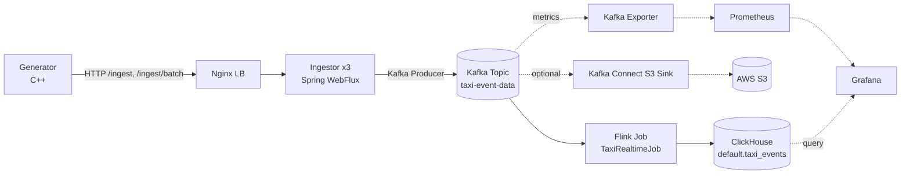

# System Architecture (Total Overview)

## 1. Scope
This document describes the end-to-end architecture of the project across single-machine and distributed deployments.

Core path:
`generator -> nginx -> ingestor -> kafka -> flink -> clickhouse`

Optional branches:
1. `kafka -> kafka connect s3 sink -> S3`
2. `prometheus + kafka-exporter + grafana`

## 2. System Context
The system replays historical NYC taxi events and processes them as near-real-time streams.

Primary goals:
1. Reliable ingestion under burst load
2. Stream processing with ordered/windowed computation
3. Durable analytics storage and visualization
4. Operable in both local single-machine and multi-machine distributed setups

## 3. End-to-End Data Flow

## 4. Component Responsibilities
| Component | Responsibility | Main Docs |
|---|---|---|
| Generator | Replays parquet data as HTTP events with batching/retry/rate-limit/circuit-breaker | `services/generator/EXPLANATION.md` |
| Nginx LB | Distributes ingest traffic to ingestor replicas | `infra/nginx/*` + `docs/runbooks/runtime.md` |
| Ingestor | Accepts HTTP events and asynchronously forwards to Kafka | `services/ingestor/EXPLANATION.md` |
| Kafka | Durable event log and fan-out source for stream processors/connectors | `infra/kafka/README.md` |
| Flink | Streaming compute and sink writes to ClickHouse | `infra/flink/Explanation.md` |
| ClickHouse | Analytical OLAP storage for taxi events | `infra/clickhouse/EXPLANATION.md` |
| Grafana/Prometheus | Monitoring, dashboarding, and operational visibility | `infra/grafana/README.md` |
| Kafka Connect (optional) | S3 export branch from Kafka topic | `infra/connectors/EXPLANATION.md` |

## 5. Deployment Topology
### 5.1 Single-machine
All components run on one host using component-local compose files.

### 5.2 Distributed multi-machine
Services are split by role (Kafka, ClickHouse, Ingestor/Nginx, Flink, Generator).

Detailed startup/stop order:
`docs/runbooks/runtime.md`

## 6. Configuration Ownership Model
High-level principles:
1. `config/.env` holds network values only (`*_IP`, `*_PORT`)
2. Runtime tuning stays in component compose files
3. Compose commands must include `--env-file config/.env`

Authoritative detail (ownership matrix, invariants, constraints):
`config/EXPLANATION.md`

## 7. Reliability and Failure Handling
1. Generator: batching, retry, adaptive rate-limiting, circuit breaker, DLQ
2. Ingestor: reactive buffering and async Kafka publish pipeline
3. Kafka: broker replication/topology by deployment mode
4. Flink: streaming job recovery behavior and sink retry considerations

Component-level failure modes and mitigations:
`services/generator/EXPLANATION.md`, `services/ingestor/EXPLANATION.md`, `infra/flink/Explanation.md`, `infra/clickhouse/EXPLANATION.md`

## 8. Observability and Validation
1. Runtime procedures: `docs/runbooks/runtime.md`
2. Validation checklist: `docs/runbooks/validation.md`
3. Change verification history: `docs/history/pipeline-optimization-2026-02-14.md`

## 9. Related Docs
1. Config model and invariants: `config/EXPLANATION.md`
2. Full runbook: `docs/runbooks/runtime.md`
3. Validation runbook: `docs/runbooks/validation.md`
4. Historical decisions: `docs/history/`
