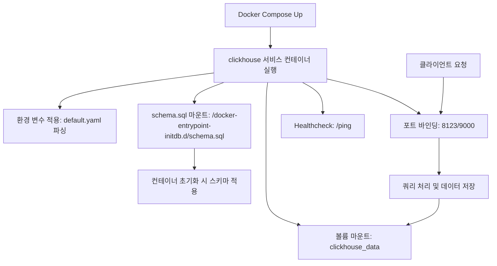

# clickhouse-docker-compose

## Role
로컬/개발 환경에서 ClickHouse 서버를 Docker Compose로 구동하고 데이터와 초기 스키마를 관리한다.

## I/O Flow
```
[Client Apps] --(HTTP 8123 / TCP 9000)--> [ClickHouse Container] --(Filesystem)--> [clickhouse_data Volume]
```

## Implementation Logic

### Data Flow


### Concurrency Model
- **Thread Model:** ClickHouse 서버 내부 스레드 풀/병렬 처리(서비스 프로세스에 위임)
- **Shared State:** 데이터는 Docker 볼륨 `clickhouse_data`에 저장되고 ClickHouse가 내부적으로 관리
- **Sync Primitives:** Compose 레벨에서는 동기화 도구 사용 없음(ClickHouse 내부 동기화에 의존)

### Core Algorithm
- ClickHouse 서버 컨테이너를 고정 버전(`clickhouse/clickhouse-server:23.8`)으로 실행한다.
- HTTP(8123)와 Native TCP(9000) 포트를 호스트에 노출한다.
- `clickhouse_data` 볼륨을 통해 데이터 디렉터리를 영속화한다.
- `infra/clickhouse/config/default.yaml`를 컨테이너 시작 시 파싱하여 런타임 환경 변수를 주입한다.
- `schema.sql`을 `/docker-entrypoint-initdb.d/`에 마운트해 초기 스키마 적용을 가능하게 한다.
- `/ping` 헬스체크로 컨테이너 상태를 주기적으로 확인한다.

## Data Contract
- **Input:**
  - 네트워크 요청: HTTP(8123) 또는 TCP(9000) 프로토콜의 SQL 쿼리
  - 초기화 파일: `infra/clickhouse/schema.sql`
- **Output:**
  - 쿼리 결과(HTTP/TCP 응답)
  - 데이터 파일(볼륨 `clickhouse_data`에 영속 저장)
- **Invariants:**
  - `clickhouse_data` 볼륨은 ClickHouse 데이터 경로(`/var/lib/clickhouse`)에 마운트되어야 한다.
  - 포트 8123/9000은 컨테이너와 호스트에서 충돌 없이 바인딩되어야 한다.

## Design Decisions
| Decision | Why | Trade-off |
|----------|-----|-----------|
| 고정 이미지 버전 `23.8` 사용 | 재현 가능한 환경 보장 | 최신 기능/보안 패치 지연 |
| 데이터 영속화 볼륨 사용 | 컨테이너 재시작/삭제에도 데이터 보존 | 로컬 디스크 사용 증가 |
| `schema.sql` 마운트 방식 | 초기 스키마 자동 적용 | 스키마 변경 시 재적용 로직 별도 필요 |
| 헬스체크 `/ping` 사용 | 간단한 생존 여부 확인 | 실제 쿼리 가능 여부까지는 보장하지 않음 |

## Failure Modes & Handling
| Failure | Detection | Response |
|---------|-----------|----------|
| 포트 충돌(8123/9000) | `docker compose up` 에러/로그 | 다른 포트로 매핑 변경 |
| 데이터 볼륨 권한/손상 | 컨테이너 로그 오류 | 볼륨 권한 확인 또는 볼륨 재생성 |
| 이미지 다운로드 실패 | `docker compose pull` 실패 | 네트워크 상태/레지스트리 접근 확인 |
| 헬스체크 실패 | 컨테이너 상태 `unhealthy` | 로그 확인 후 재시작/리소스 증설 |
| 초기 스키마 미적용 | 테이블 없음/로그 | `schema.sql` 경로/내용 확인 및 재기동 |
