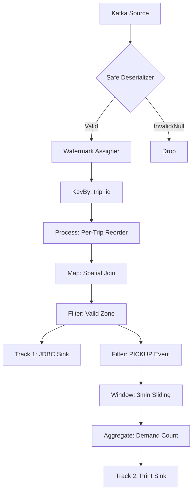

# Flink Processor

## Role
Kafka로부터 유입되는 원시 택시 이벤트를 수집하여 **순서 재정렬(Reordering)** 및 **3분 이동 평균 수요**를 집계하고, 결과를 ClickHouse에 저장하는 고신뢰성 분산 스트리밍 컴포넌트입니다.

## I/O Flow
`[Kafka Source] --(TaxiEvent)--> [TaxiRealtimeJob] --(JDBC Sink)--> [ClickHouse]
                                        L--(Log Out)--> [Console: ML_DEMAND]`

## Implementation Logic

### Data Flow

### Concurrency Model
* **Thread Model**: 기본 병렬도(`Parallelism`)는 **6**으로 설정되어 있으며, 각 TaskManager의 슬롯에 태스크가 분산 배치됩니다.
* **Shared State**:
    * **bufferState (ListState)**: 각 `trip_id`별 재정렬을 위한 대기 큐입니다.
    * **lastEmittedTs (ValueState)**: 이미 배출된 데이터보다 과거 데이터가 들어오는 것을 방지하기 위한 타임스탬프 기록기입니다.
* **State Management**: **Idle Cleanup** 로직을 통해 20분간 활동이 없는 키의 상태를 자동 삭제하여 메모리 누수를 방지합니다.

### Core Algorithm
* **Per-Trip Reordering**: `KeyedProcessFunction` 내에서 `TimerService`를 활용합니다. Watermark가 데이터 시각 + 5초를 지나는 시점에 버퍼를 소팅하여 배출합니다.
* **Sliding Window**: `DemandAggregator`를 통해 최근 3분간의 데이터를 1분 간격으로 집계하여 실시간 수요 변화를 추적합니다.

## Data Contract
* **Input**: Kafka `taxi-event-data` 토픽의 JSON 데이터 (`trip_id`, `ts`, `lat`, `lon`, `event`).
* **Output**:
    * **ClickHouse**: `trip_id`, `ts`, `zone_id`, `event` (정규화된 문자열).
    * **Console**: `[ML_DEMAND] Zone: {id}, Time: {ts}, Count: {n}`.
* **Invariants**: `trip_id`가 null이거나 `ts` 파싱이 불가능한 데이터는 `LATE_DROP` 사이드 아웃풋으로 분리됩니다.

## Design Decisions
| Decision | Why | Trade-off |
| :--- | :--- | :--- |
| **Parallelism 6** | 가용 자원(3대 TM * 2 Slot)을 최대로 활용하여 처리량을 극대화하기 위함입니다. | 8GB 환경에서 CPU 부하가 높을 수 있습니다. |
| **Idle Cleanup (20m)** | 분산 환경에서 무한히 늘어날 수 있는 상태(State) 크기를 제어하기 위함입니다. | 20분 이상 지연된 매우 늦은 데이터는 정렬 혜택을 받지 못합니다. |
| **JDBC Batch (5000)** | ClickHouse의 쓰기 성능 최적화를 위해 대량으로 묶어서 적재합니다. | 배치 주기(1초)만큼 DB 반영에 시차가 발생합니다. |

## Failure Modes & Handling
| Failure | Detection | Response |
| :--- | :--- | :--- |
| **Deserialization Error** | `SafeTaxiEventSchema`의 `catch` 블록에서 감지됩니다. | 에러 로그 출력 후 해당 메시지만 Skip하여 전체 파이프라인 중단을 방지합니다. |
| **Late/Out-of-order** | `eventTs <= wm` 조건으로 감지됩니다. | `LATE_EVENTS` 사이드 아웃풋(Side Output)으로 전송하여 별도로 모니터링합니다. |
| **Sink Retry** | JDBC Sink 내부 예외 발생 시 감지됩니다. | 최대 5회까지 재시도(`withMaxRetries(5)`)하며 복구를 시도합니다. |
