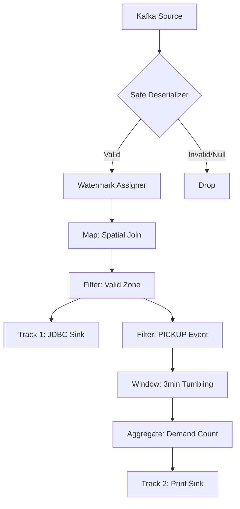

# Flink Processor

## Role
Kafka로부터 유입되는 원시 택시 이벤트를 실시간으로 정제(Enrichment)하고, 3분 단위 수요 지표를 산출하여 OLAP(ClickHouse) 및 분석 시스템으로 전달합니다.

## I/O Flow
`[Kafka (taxi_raw_events)]` --(Kafka Protocol)--> `[Flink Processor]` --(JDBC/Stdout)--> `[ClickHouse / Console]`

## Implementation Logic

### Data Flow

### Concurrency Model
* **Thread Model**: **Single-threaded Execution Environment** (Parallelism = 1). 시연 환경의 자원 최적화 및 로그 순서 보장을 위해 단일 스레드로 설정되었습니다.
* **Shared State**: **Flink Managed Window State**. 윈도우 연산(TumblingEventTimeWindows) 중에 구역별 픽업 카운트가 Flink의 내부 상태 저장소에 보관됩니다.
* **Sync Primitives**: 별도의 명시적 Lock 대신, Flink의 Event-time 기반 워터마크 메커니즘을 사용하여 데이터의 순서와 동기화를 보장합니다.

### Core Algorithm
* **Spatial Join Enrichment**: 위경도 데이터를 기반으로 구역 ID를 매핑하여 원본 데이터를 보강합니다.
* **Event-Time Windowing**: 데이터 내부의 타임스탬프(ts)를 기준으로 윈도우를 생성하여 데이터 지연 발생 시에도 정확한 집계를 보장합니다.
* **Data Normalization**: normType()을 통해 산재한 이벤트 문자열 규격을 정규화하여 집계 정확도를 높입니다.

## Data Contract
* **Input**: JSON (trip_id: Long, ts: String(ISO-8601), lat/lon: Double, event: String)
* **Output**:
    * **(Track 1)** JDBC Insert (Enriched Raw Data)
    * **(Track 2)** String Log ([ML_DEMAND] Zone, WindowEnd, Count)
* **Invariants**: 모든 출력 데이터는 반드시 zone_id가 null이 아니어야 하며, PICKUP 이벤트만 수요 집계에 포함됩니다.

## Design Decisions
| Decision | Why | Trade-off |
| :--- | :--- | :--- |
| **Parallelism=1** | 디버깅 편의성 및 시연용 로그 순서 보장 | 대규모 데이터 처리 속도 제한 |
| **Earliest Offset** | 장애 복구 시 데이터 유실 방지(At-least-once) | 재시작 시 일부 데이터 중복 발생 가능성 |
| **Print Sink (Track 2)** | ML 피처 데이터의 실시간 모니터링 및 검증 | 하류 시스템과의 자동화된 연동 부족 |

## Failure Modes & Handling
| Failure | Detection | Response |
| :--- | :--- | :--- |
| **Deserialization Error** | safeSchema 내 try-catch 감지 | 해당 레코드 null 반환 후 Filter에서 Drop |
| **JDBC Connect Fail** | SocketException 발생 | Flink Job 중단 및 수동 재시작 유도 |
| **Late Data** | Watermark 지연 시간(5s) 초과 | 윈도우 연산에서 제외하여 데이터 정합성 유지 |