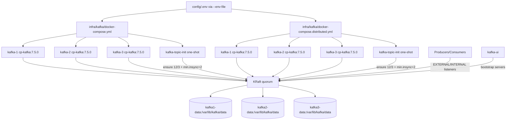

# Kafka

## Role
Provide a 3-node Kafka cluster (KRaft mode) that durably stores event streams, fans out to downstream processors/connectors, and enforces topic shape guardrails via `kafka-topic-init`.

## I/O Flow
```
[Ingestor / Clients] --(Kafka protocol, PLAINTEXT)--> [Kafka Cluster (3 brokers, KRaft)] --(Kafka protocol / HTTP)--> [Flink / Connectors / Kafka UI]
```

## Implementation Logic

### Data Flow


### Concurrency Model
- **Thread Model:** Multi-process (3 broker containers + optional Kafka UI). Each broker runs Kafka's internal multi-threaded runtime (network I/O, request handling, replication, controller logic).
- **Shared State:** Durable broker state is stored in per-broker Docker volumes (`kafka1-data`, `kafka2-data`, `kafka3-data`). Cluster metadata and partition replicas are coordinated across brokers through the configured KRaft quorum.
- **Sync Primitives:** No repository-level synchronization code exists for this component (no `synchronized`, `Lock`, `volatile`, `CompletableFuture` in `infra/kafka/*`). Concurrency control is delegated to Kafka internals (KRaft consensus and broker replication mechanics).

### Core Algorithm
1. Compose reads network variables from `config/.env` (`--env-file` is required for deterministic variable substitution).
2. Three brokers start with fixed node IDs (`1,2,3`), shared `CLUSTER_ID`, and `KAFKA_PROCESS_ROLES=broker,controller`.
3. Brokers form a KRaft controller quorum using `KAFKA_CONTROLLER_QUORUM_VOTERS`.
4. Clients connect through advertised listeners:
   - Single-machine: external per-broker ports, shared internal/controller port values.
   - Distributed: per-broker external/internal/controller ports and host IPs.
5. Messages are appended to partitions and persisted under `/var/lib/kafka/data` (per broker volume).
6. Internal Kafka topics and transactional state use replication settings in compose (`default.replication.factor=3`, transaction state replication=3, `min.insync.replicas=2`).
7. `kafka-topic-init` one-shot 서비스가 `taxi-event-data`의 shape를 자동 강제/검증합니다.
   - target: `partitions=12`, `replication-factor=3`, `min.insync.replicas=2`
   - `RF != 3`는 자동 복구하지 않고 실패 처리(운영자 조치 필요)합니다.
8. `kafka-ui` connects via configured bootstrap servers for metadata/topic inspection.

## Data Contract
- **Input:**
  - Runtime env keys from `.env` used by compose variable substitution (`KAFKA_*_IP`, `KAFKA_*_PORT`, `KAFKA_UI_PORT`).
  - Kafka protocol traffic on broker listeners:
    - `EXTERNAL` for client access.
    - `INTERNAL` for inter-broker/client-in-network access.
    - `CONTROLLER` for KRaft quorum traffic.
- **Output:**
  - Durable topic log segments in broker volumes (`/var/lib/kafka/data`).
  - Replicated internal metadata/offset/transaction topics according to broker settings.
  - Kafka UI HTTP endpoint (`:8080` in container, mapped by `KAFKA_UI_PORT`) for operational visibility.
- **Invariants:**
  - All brokers must share the same `CLUSTER_ID`.
  - `KAFKA_NODE_ID` values must be unique per broker.
  - `KAFKA_CONTROLLER_QUORUM_VOTERS` must be consistent and routable from all brokers.
  - `KAFKA_ADVERTISED_LISTENERS` must expose reachable host/IP:port pairs for the target deployment mode.
  - Replication settings (`KAFKA_DEFAULT_REPLICATION_FACTOR=3`, txn replication=3, `KAFKA_MIN_INSYNC_REPLICAS=2`) require at least two healthy brokers for in-sync writes and generally three for full-replica availability.
  - `taxi-event-data`는 `kafka-topic-init` 정책 기준 `12/3/min.insync=2`를 유지해야 합니다.

## Design Decisions
| Decision | Why | Trade-off |
|----------|-----|-----------|
| KRaft mode (`broker,controller`) without ZooKeeper | Simplifies deployment topology and removes ZooKeeper dependency | Controller and broker share process resources; quorum config errors directly affect cluster availability |
| 3-broker topology | Supports replication and basic fault tolerance | Higher resource usage than single broker |
| Separate listener roles (`EXTERNAL`, `INTERNAL`, `CONTROLLER`) | Cleanly separates client traffic, broker traffic, and quorum traffic | More ports and environment variables to manage |
| Replication defaults set to `3` (`min ISR=2`) | Increases durability for default topics and internal state in a 3-node cluster | Higher broker quorum dependency than RF=2 under degraded conditions |
| Per-broker persistent volumes | Preserves logs across container restarts | Requires disk capacity monitoring and cleanup policy management |
| Distinct distributed per-broker ports (`9092/9094/9096`, `29092/29094/29096`, `19093/19094/19095`) | Avoids port collisions and clarifies routing in multi-machine/local simulation | More complex network configuration and firewall rules |
| `kafka-topic-init` one-shot guardrail | Topic shape drift를 기동 시 자동 교정/검증하기 위함 | RF mismatch는 수동 운영 절차가 필요 |

## Failure Modes & Handling
| Failure | Detection | Response |
|---------|-----------|----------|
| Invalid `KAFKA_ADVERTISED_LISTENERS` (wrong IP/port) | Clients fail to connect after metadata fetch; producer/consumer timeout errors | Correct `.env` IP/port values and restart affected brokers |
| Quorum voter mismatch or unreachable controller endpoints | Broker healthcheck fails; broker repeatedly restarts or cannot elect controller | Align `KAFKA_CONTROLLER_QUORUM_VOTERS` across all brokers and verify controller port reachability |
| Port collision on host mappings | `docker compose up` fails with port bind errors | Use the documented per-broker port keys and avoid conflicting local services |
| Broker count drops below replication requirements | Topic creation/write failures for replicated internal/transaction topics | Recover failed brokers or adjust replication/ISR settings for degraded mode |
| `taxi-event-data` shape drift (`12/3/min.insync=2` 불일치) | `kafka-topic-init` 로그 또는 `kafka-topics --describe` 결과에서 감지 | `kafka-topic-init` 재실행, RF mismatch 시 reassignment/reset 운영 절차 수행 |
| Disk pressure in `/var/lib/kafka/data` | Broker logs report I/O errors or retention pressure; produce latencies/failures increase | Increase disk, adjust retention (`KAFKA_LOG_RETENTION_HOURS`), or clean up safely |
| Missing/incorrect `--env-file config/.env` at runtime | Compose variable substitution warnings, unexpected defaults, wrong listener bindings | Re-run compose commands with `--env-file config/.env` and validated env values |
