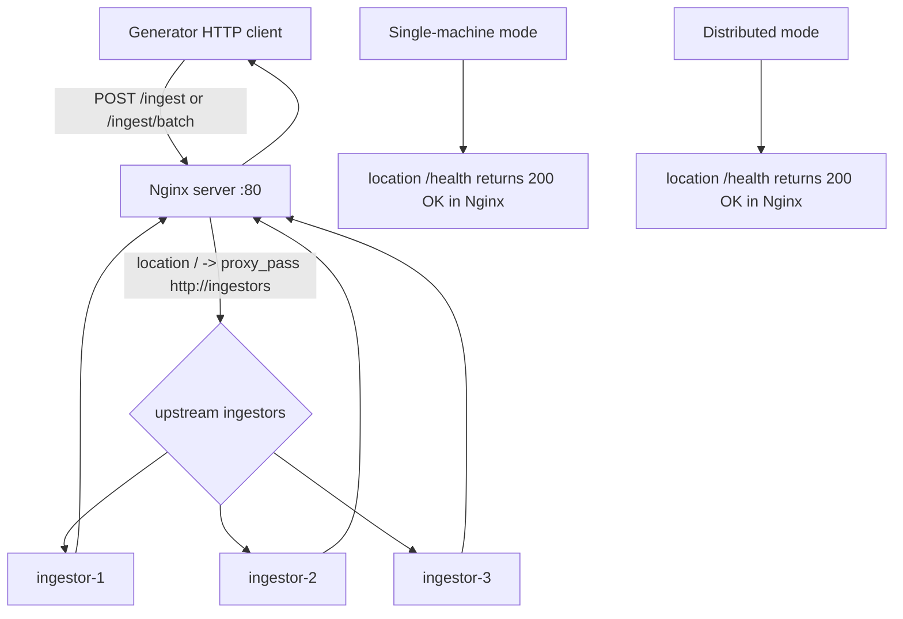

# Nginx Load Balancer

## Role
Receives generator HTTP ingest traffic and forwards it to three ingestor replicas using `least_conn` with upstream retry settings.

## I/O Flow
```
[Generator] --(HTTP POST /ingest or /ingest/batch)--> [Nginx LB] --(HTTP proxy_pass)--> [Ingestor x3]
```

## Implementation Logic

### Data Flow


### Concurrency Model
- **Thread Model:** Nginx event-driven worker model (`events { worker_connections ... }`) handling many concurrent sockets per worker.
- **Shared State:** Managed inside Nginx runtime, mainly upstream selection/runtime counters, upstream keepalive connection pool (`keepalive 64`), and access log buffers/files.
- **Sync Primitives:** No application-level primitives such as `synchronized`, `Lock`, `CompletableFuture`, or `volatile` are used in this component code. Concurrency control is delegated to Nginx internals.

### Core Algorithm
1. Accept request on port `80` (published as `${NGINX_LB_PORT}` via compose).
2. Match path:
   - Single-machine config:
     - `/health` -> immediate `200 OK` from Nginx.
     - all other paths -> proxy to `upstream ingestors`.
   - Distributed template:
     - `/health` -> immediate `200 OK` from Nginx.
     - all other paths -> proxy to `upstream ingestors`.
3. Select upstream by `least_conn`.
4. Forward request with preserved client headers (`Host`, `X-Real-IP`, `X-Forwarded-For`, and in single-machine config also `X-Forwarded-Proto`).
5. On upstream errors/timeouts/502/503/504, retry another upstream up to `proxy_next_upstream_tries 2`.
6. Return upstream response status/body to caller and write access logs with upstream timing/status fields.

## Data Contract
- **Input:**
  - HTTP requests from generator or operators.
  - Typical ingest endpoints:
    - `POST /ingest` (JSON object)
    - `POST /ingest/batch` (JSON array)
  - Request body limit: `client_max_body_size 10m`.
- **Output:**
  - Proxied HTTP response from selected ingestor (`202`, `207`, `400`, `429`, `500`, etc.).
  - Both modes: `GET /health` returns plain `OK` directly from Nginx.
  - Access log entries with `upstream_addr`, `upstream_status`, `request_time`, `upstream_response_time`.
- **Invariants:**
  - Exactly three upstream targets are configured in both modes.
  - Load-balancing policy is always `least_conn`.
  - Upstream retry policy is always `error timeout http_502 http_503 http_504` with max `2` tries.
  - Distributed mode upstream addresses are resolved from `.env` variables through `envsubst` at container start.

## Design Decisions
| Decision | Why | Trade-off |
|----------|-----|-----------|
| `least_conn` upstream policy | Prefers less-loaded ingestors and reduces skew under uneven response times | Very low concurrency traffic can still show short-term imbalance |
| Request-level failover (`proxy_next_upstream`, `proxy_next_upstream_tries`) | Retries transient upstream failures without extra modules | No long-term upstream quarantine; persistent failures still need external remediation |
| Keepalive upstream pool (`keepalive 64`) | Reduces TCP connection setup overhead to ingestors | Consumes persistent upstream connection slots/memory |
| Distributed config via `envsubst` template | One template supports multiple machine IP/port deployments | Startup depends on complete `.env` variables; missing vars can break generated config |
| `/health` served by Nginx in both modes | Fast LB liveness check independent of ingestor status | `/health` does not represent upstream ingestor health |

## Failure Modes & Handling
| Failure | Detection | Response |
|---------|-----------|----------|
| One ingestor returns `502/503/504` or times out | `proxy_next_upstream` conditions are met | Retry another ingestor (up to 2 tries) and surface final response |
| Repeated failures from same ingestor | High upstream error ratio persists in access/error logs | Immediate per-request retry still applies; fix/remove bad backend via container orchestration |
| Backend connection/read/send timeout | `proxy_connect_timeout` / `proxy_read_timeout` / `proxy_send_timeout` | Request fails over to another upstream if retry budget remains |
| Oversized request body | Nginx enforces `client_max_body_size 10m` | Request is rejected at LB layer (no upstream forwarding) |
| Missing distributed env vars for template rendering | Invalid generated `nginx.conf` or bad upstream addresses | Container startup/proxying fails until `.env` variables are corrected |
