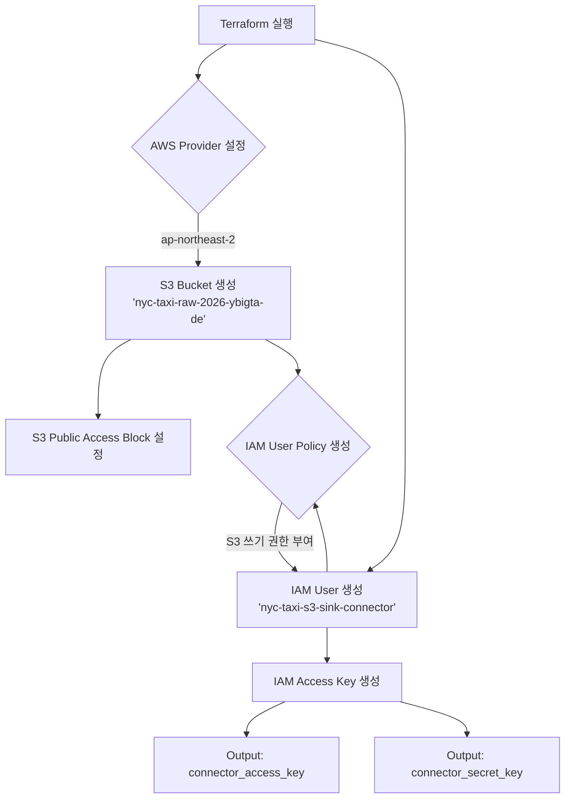

# Terraform AWS S3 Data Lake

## Role
이 컴포넌트는 NYC Taxi 데이터 프로젝트를 위한 데이터 레이크를 AWS S3에 프로비저닝하고, 외부 시스템(예: Kafka Connect)이 안전하게 데이터를 쓸 수 있도록 IAM 사용자 및 권한을 설정하는 역할을 합니다.

## I/O Flow
```
[Terraform CLI] --(AWS Credentials)--> [This Component] --(IAM Credentials)--> [S3 Sink Connector]
```
- **Upstream:** Terraform 실행을 위한 AWS 계정의 Access Key와 Secret Key를 입력받습니다 (`variables.tf`).
- **Downstream:** 생성된 IAM 사용자의 Access Key와 Secret Key를 출력하여, Kafka S3 Sink Connector와 같은 외부 시스템이 S3 버킷에 접근할 수 있도록 합니다.

## Implementation Logic

### Data Flow


### Concurrency Model
- **State Management:** Terraform은 `terraform.tfstate` 파일을 통해 인프라의 상태를 관리합니다. 이 상태 파일을 통해 여러 번의 실행이나 여러 팀원이 작업할 때 발생할 수 있는 충돌을 방지하고 일관성을 유지합니다 (State Locking).
- **Execution:** Terraform의 실행 모델은 선언적이며, 리소스 간의 의존성을 그래프로 만들어 병렬로 생성/수정할 수 있는 리소스들을 동시에 처리합니다. 코드 자체에는 동시성 제어 로직이 없습니다.

### Core Algorithm
1.  **Provider 설정:** AWS `ap-northeast-2` 리전을 사용하도록 설정하고, `variables.tf`를 통해 받은 AWS 자격증명을 주입합니다.
2.  **S3 버킷 생성:** `nyc-taxi-raw-2026-ybigta-de` 라는 이름으로 데이터 레이크용 S3 버킷을 생성합니다.
3.  **보안 강화:** 생성된 버킷에 대한 모든 퍼블릭 액세스를 차단하여 데이터를 보호합니다.
4.  **전용 사용자 생성:** Kafka S3 Sink Connector가 사용할 전용 IAM 사용자인 `nyc-taxi-s3-sink-connector`를 생성합니다.
5.  **권한 부여:** 생성된 사용자에게 해당 S3 버킷 및 그 안의 객체들에 대한 `PutObject`, `GetObject`, `ListBucket`, `AbortMultipartUpload` 권한을 부여하는 정책을 생성하고 연결합니다.
6.  **키 생성 및 출력:** 생성된 IAM 사용자가 AWS에 프로그래밍 방식으로 접근할 수 있도록 Access Key와 Secret Key를 생성하고, 이를 `output`으로 외부에 노출합니다.

## Data Contract
- **Input:**
  - `aws_access_key` (string, sensitive): Terraform이 AWS 리소스를 프로비저닝하는 데 사용할 AWS 계정의 액세스 키 ID.
  - `aws_secret_key` (string, sensitive): 해당 AWS 계정의 시크릿 액세스 키.
- **Output:**
  - `connector_access_key` (string): 생성된 IAM 사용자의 액세스 키 ID.
  - `connector_secret_key` (string, sensitive): 생성된 IAM 사용자의 시크릿 액세스 키.
- **Invariants:**
  - S3 버킷은 항상 Private 상태를 유지해야 합니다.
  - 생성된 IAM 사용자는 지정된 S3 버킷 외의 다른 리소스에 접근할 수 없습니다.

## Design Decisions
| Decision | Why | Trade-off |
|----------|-----|-----------|
| **전용 IAM User 사용** | 최소 권한 원칙을 준수하여 Kafka Connector가 필요한 권한(S3 쓰기)만 갖도록 제한하고 보안을 강화했습니다. | 루트 키나 범용 키를 사용하는 것보다 관리해야 할 IAM 사용자가 늘어납니다. |
| **S3 Public Access 완전 차단** | 데이터 레이크의 데이터가 의도치 않게 외부에 노출되는 것을 원천적으로 방지하기 위함입니다. | 만약 특정 데이터를 외부에 공개해야 할 경우, CloudFront나 Signed URL과 같은 별도의 복잡한 구성이 필요합니다. |
| **하드코딩된 버킷 이름 사용** | 이 프로젝트 전용으로 사용되며, 버킷 이름의 유일성 제약 때문에 명시적으로 이름을 지정하는 것이 관리상 편리하다고 판단했습니다. | 다른 환경이나 다른 목적으로 이 Terraform 코드를 재사용하기 어렵습니다. 재사용성을 높이려면 변수로 만들어야 합니다. |

## Failure Modes & Handling
| Failure | Detection | Response |
|---------|-----------|----------|
| **AWS 자격증명 오류** | `terraform plan` 또는 `apply` 실행 시 AWS API 인증 에러 (401/403)가 발생합니다. | `terraform.tfvars` 또는 환경 변수에 올바른 AWS Access Key와 Secret Key가 설정되었는지 확인하고 수정 후 다시 실행합니다. |
| **S3 버킷 이름 중복** | `apply` 실행 중 `BucketAlreadyExists` 에러가 발생합니다. S3 버킷 이름은 전역적으로 유일해야 합니다. | `main.tf`의 `aws_s3_bucket` 리소스에서 `bucket` 이름을 다른 것으로 변경합니다. |
| **IAM 정책 권한 부족** | Kafka Connector가 S3에 데이터를 쓰지 못하고 `Access Denied` 에러를 로그에 남깁니다. | `main.tf`의 `aws_iam_user_policy` 리소스에 필요한 `Action`이 모두 포함되었는지 확인하고, 수정 후 `apply`하여 정책을 업데이트합니다. |
