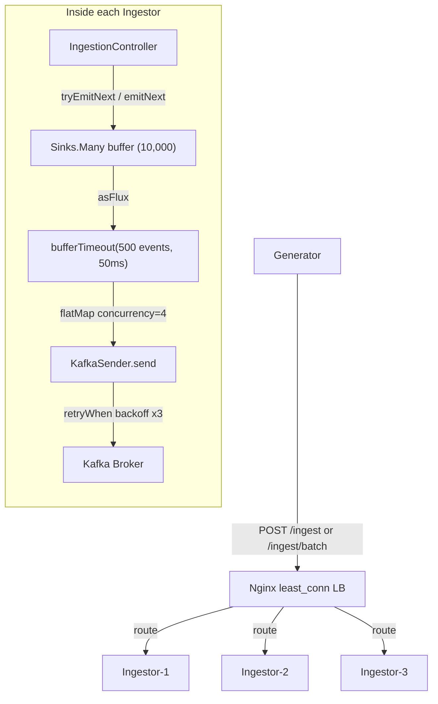

# Ingestor

## Role
An ingestion gateway that receives TaxiEvents from the Generator over HTTP, buffers them in an internal Reactive Sink, and forwards them asynchronously to the Kafka topic `taxi-event-data`.

## I/O Flow
```
[Generator (C++)] --(HTTP POST /ingest, JSON)--> [Nginx LB] --(least_conn)--> [Ingestor x3] --(Reactor Kafka, key=tripId)--> [Kafka: taxi-event-data]
```

## Implementation Logic

### Data Flow


### Concurrency Model
- **Thread Model:** Event-loop (Netty). Both WebFlux and Reactor Kafka are fully non-blocking. No explicit thread creation anywhere in the application.
- **Shared State:**
  - `Sinks.Many<TaxiEvent>` — the single multicast buffer (capacity 10,000). Multiple HTTP request threads can emit into it concurrently.
  - `AtomicLong` x5 (`eventsReceived`, `eventsProcessed`, `eventsFailed`, `eventsDropped`, `batchesSent`) — lock-free metric counters.
  - `KafkaSender` — singleton bean with a lazy connection; connects on the first `send()` call.
- **Sync Primitives:**
  - `Sinks.EmitFailureHandler` — retries only on `FAIL_NON_SERIALIZED` (concurrent emit collision) via a busy-loop. All other failures are not retried.
  - `AtomicLong` — CAS-based lock-free increment for counters.
  - `AtomicInteger` — used in the batch endpoint to track `successCount` / `failedCount`.
  - No `synchronized` or `Lock` anywhere. All concurrency is handled through Reactor primitives.

### Core Algorithm

**Single-event path (`POST /ingest`)**
1. WebFlux deserializes the request body into a `TaxiEvent`.
2. `IngestionService.ingest()` is called, which attempts `sink.tryEmitNext(event)`.
3. If the result is `FAIL_NON_SERIALIZED`, it falls back to `sink.emitNext(event, emitFailureHandler)` for a busy-loop retry.
4. If the result is `FAIL_OVERFLOW`, the event is dropped and HTTP 429 is returned.
5. If `OK`, HTTP 202 is returned immediately. The actual Kafka send happens asynchronously in the pipeline below.

**Batch path (`POST /ingest/batch`)**
1. The event list is iterated sequentially; each event is passed to `ingest()`.
2. On `FAIL_OVERFLOW`, the loop exits immediately. Unprocessed events are counted as rejected, and HTTP 429 is returned with a `BatchIngestResponse` body.
3. Partial success returns HTTP 207; full success returns HTTP 202.

**Internal pipeline (wired in `IngestionService @PostConstruct`)**
1. `sink.asFlux()` — consumes events from the buffer as a Flux.
2. `bufferTimeout(500, 50ms)` — forms a batch when either 500 events accumulate or 50 ms elapses, whichever comes first.
3. `flatMap(sendBatchToKafkaReactive, concurrency=4)` — up to 4 batches are sent to Kafka concurrently.
4. Within each batch, a `SenderRecord` is created with `tripId` as the key and the Jackson-serialized JSON as the value.
5. `kafkaSender.send()` is called. On failure, `Retry.backoff(3, 100ms, maxBackoff=2s)` is applied.
6. If the entire subscription terminates, `.retry()` re-subscribes automatically.

**Metrics & Shutdown**
- `Flux.interval(10s)` — logs received / processed / failed / dropped / batch counts every 10 seconds.
- `@PreDestroy` — calls `sink.tryEmitComplete()`, waits 5 s to let the pipeline drain, then closes the `KafkaSender`.
- `Runtime.addShutdownHook` — closes the Spring application context.

## Data Contract
- **Input:**
  - `POST /ingest` — body: a single `TaxiEvent` JSON object.
  - `POST /ingest/batch` — body: a JSON array of `TaxiEvent` objects.
  - `GET /health` — no parameters.
- **Output:**
  - Kafka topic `taxi-event-data` — key: `tripId` (String), value: `TaxiEvent` JSON. Partition assignment is determined by key hashing.
  - HTTP responses: 202 (accepted), 429 (buffer full), 207 (partial batch success), 500 (other failures).
  - `/ingest/batch` response body: `{ acceptedCount, rejectedCount, failedIndices[] }`.
- **Invariants:**
  - `tripId` is always present and used as the Kafka message key — events with the same `tripId` are guaranteed to land on the same partition.
  - When the buffer exceeds 10,000 events, new events are dropped and the client receives 429. No internal retry for overflow.
  - `acks=1` (leader ack only) — only the Kafka leader's receipt is confirmed. Follower replication failures are not detected.

## Design Decisions
| Decision | Why | Trade-off |
|----------|-----|-----------|
| Spring WebFlux (Netty event-loop) | Handles HTTP reception in a non-blocking manner, achieving high concurrency without being limited by thread count | Higher debugging complexity compared to Spring MVC |
| Reactor Kafka (`KafkaSender`) | Kafka produce is also non-blocking, so it never blocks the HTTP event-loop | More complex API compared to Spring Kafka's `KafkaTemplate` |
| `Sinks.Many` multicast buffer (10,000) | Decouples HTTP receive speed from Kafka send speed, absorbing latency spikes | Events can be lost on buffer overflow |
| `bufferTimeout(500, 50ms)` | Dramatically reduces Kafka network round-trips compared to sending events individually | Introduces up to 50 ms of additional latency |
| `acks=1` (leader only) | Maximizes throughput | Acknowledged messages can be lost if the leader fails before replication |
| LZ4 compression | Reduces network bandwidth with minimal CPU overhead | Lower compression ratio than Snappy or Gzip |
| Nginx `least_conn` | Distributes load based on each instance's actual current connection count | Nginx must maintain per-upstream connection state (vs. stateless round-robin) |
| 3-instance cluster | Horizontally scales both buffer capacity and Kafka send throughput beyond a single instance | Each instance holds an independent Sink, so event ordering by `tripId` is not guaranteed at the cluster level |
| `stopOnError(false)` on KafkaSender | A single event's serialization or send failure does not terminate the entire pipeline | Failed events can be silently skipped |

## Failure Modes & Handling
| Failure | Detection | Response |
|---------|-----------|----------|
| Sink buffer overflow (exceeds 10,000) | `tryEmitNext()` returns `FAIL_OVERFLOW` | Event is dropped; HTTP 429 is returned. The Generator backs off via its own rate limiter and retries. |
| Concurrent emit collision | `tryEmitNext()` returns `FAIL_NON_SERIALIZED` | Falls back to `emitNext()` with a busy-loop retry. If it still fails, treated as `FAIL_OVERFLOW`. |
| Kafka send failure (network / broker) | `SenderResult.exception() != null` | `Retry.backoff(3, 100ms, max 2s)`. After 3 attempts, the entire batch is logged as failed and `eventsFailed` is incremented. |
| JSON serialization failure | Exception thrown by `ObjectMapper.writeValueAsString()` | Only the affected event is skipped (`Mono.empty()`); `eventsFailed` increments; the rest of the batch continues. |
| Pipeline subscription termination | Terminal `onError` signal in the Flux chain | `.retry()` automatically re-subscribes to the pipeline. |
| Ingestor instance crash | Nginx health check (`GET /health`) fails (10 s interval, 3 retries) | Nginx marks that upstream as unhealthy and routes traffic to the remaining instances. |
| Graceful shutdown | JVM shutdown hook + Spring `@PreDestroy` | Sink is completed, pipeline drains for up to 5 s, then `KafkaSender` is closed. |
| Kafka broker unavailable at startup | `KafkaSender` uses a lazy connection | The application starts without blocking. Actual send failures are covered by the retry policy. |
