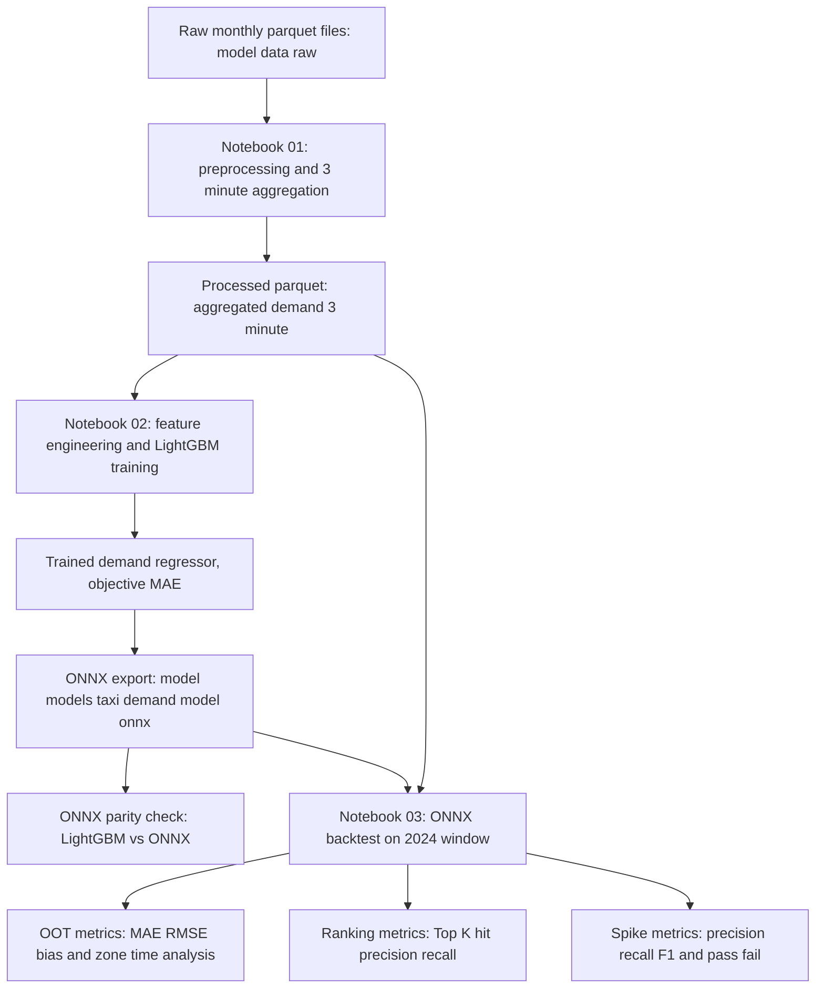

# Model

## Role
Builds and validates a zone-level taxi demand forecasting model (3-minute feature step, 15-minute horizon) and exports a serving artifact (`ONNX`) for downstream Flink inference.

## I/O Flow
```
[NYC trip Parquet files in model/data/raw] --(Polars batch read)--> [Model notebooks] --(Parquet + ONNX artifacts)--> [Flink serving/inference chain]
```

## Implementation Logic

### Data Flow


### Concurrency Model
- **Thread Model:** Notebook-driven batch pipeline, mostly single-process sequential orchestration.
- **Shared State:**
  - File artifacts on disk:
    - `model/data/processed/aggregated_demand_3min.parquet`
    - `model/models/taxi_demand_model.onnx`
  - In-memory DataFrames/arrays (`polars`, `numpy`, `pandas`) per notebook kernel session.
- **Sync Primitives:**
  - No explicit Python synchronization primitives (`Lock`, `synchronized`, `volatile`, etc.) in notebook code.
  - LightGBM internally uses native multi-thread execution during training (library-managed, not user-managed synchronization in code).

### Core Algorithm
1. **Preprocessing (01):**
   - Read raw trip parquet files lazily with Polars.
   - Normalize columns, apply data-quality/date filters.
   - Aggregate pickups by `(pickup_time_3min, PULocationID)` as `demand`.
   - Upsample each zone timeline and fill missing demand with `0`.
2. **Feature + Train (02):**
   - Build time features (`hour`, `day_of_week`, `is_weekend`).
   - Build lag/rolling features (lite/full mode).
   - Build target as `demand` shifted by `HORIZON_STEPS` (default 5 = 15 minutes ahead).
   - Time-based split using latest-time anchored cutoff (`TEST_MONTHS`).
   - Train `LightGBMRegressor` with early stopping.
3. **Export + Verify (02):**
   - Convert LightGBM model to ONNX.
   - Store feature order metadata in ONNX.
   - Verify ONNX output parity against LightGBM on multiple samples.
4. **Backtest (03):**
   - Run ONNX inference on 2024 out-of-time window.
   - Evaluate:
     - Regression metrics (MAE/RMSE/Bias, naive comparison)
     - Zone/time-segment diagnostics
     - Top-K ranking quality (for recommendation serving)
     - Spike detection precision/recall/F1
   - Emit PASS/FAIL gate summary.

## Data Contract
- **Input:**
  - Raw parquet files with trip records under `model/data/raw`.
  - Required fields include timestamp and zone id needed to produce:
    - `pickup_time`
    - `PULocationID`
    - demand count by interval
  - For backtest/inference:
    - `model/data/processed/aggregated_demand_3min.parquet`
    - `model/models/taxi_demand_model.onnx`
- **Output:**
  - Processed time-series demand parquet:
    - `model/data/processed/aggregated_demand_3min.parquet`
  - Serving model artifact:
    - `model/models/taxi_demand_model.onnx`
  - Evaluation outputs in notebook logs/tables:
    - overall metrics, zone/time metrics, Top-K metrics, spike metrics, PASS/FAIL
- **Invariants:**
  - Feature schema and order used at ONNX inference must match training-time schema.
  - `HORIZON_STEPS` must remain consistent between train and backtest (default: 5).
  - Time-based splits must avoid shuffle to prevent leakage.
  - `FEATURE_MODE` in backtest must match the exported model’s expected feature set.

## Design Decisions
| Decision | Why | Trade-off |
|----------|-----|-----------|
| 3-minute aggregation and feature step | Aligns with current Flink-side 3-minute cadence while preserving short-horizon responsiveness | Higher data volume and heavier training load than coarse windows |
| `HORIZON_STEPS=5` (15-minute ahead point forecast) | Keeps serving target consistent with “near-future next-point” recommendation use case | Not equivalent to full 15-minute cumulative demand forecasting |
| `FEATURE_MODE="lite"` default (`demand_lag_20` + time/zone) | Reduces feature-engineering/serving complexity for Flink integration | May underfit compared to richer lag/rolling feature sets |
| Time-based split anchored at latest timestamp | Prevents leakage and supports rolling recent-window training | Sensitive to date coverage; bad window settings can produce empty train/test |
| ONNX export with metadata feature order | Makes serving integration deterministic and schema-auditable | Requires strict schema discipline at inference time |
| Add Top-K and spike metrics in OOT backtest | Matches downstream recommendation objective better than MAE alone | Extra evaluation complexity and threshold tuning |

## Failure Modes & Handling
| Failure | Detection | Response |
|---------|-----------|----------|
| Missing raw/processed parquet file | File read exception in notebooks | Verify path and regenerate via notebook 01 before notebook 02/03 |
| Empty train/test split (`Train samples: 0`) | Explicit ValueError in notebook 02 | Adjust `RECENT_MONTHS` / `TEST_MONTHS` window |
| ONNX runtime unavailable | Import error (`onnxruntime not installed`) | Install dependency in model venv (`pip install onnxruntime`) |
| ONNX input schema mismatch | Inference error (missing/mismatched inputs) | Ensure `FEATURE_MODE`, feature order, and dtype alignment with exported model |
| Kernel crash during training | Notebook kernel restart/crash | Reduce data window, keep `FEATURE_MODE=lite`, or run on higher-memory environment |
| Parity regression after conversion | Multi-sample diff metrics exceed tolerance | Re-export ONNX and verify conversion/input mapping before serving |
