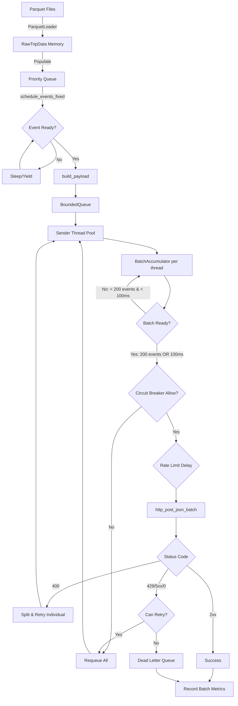

# Generator (NYC Taxi Traffic Simulator)

## Role
Replays historical NYC taxi trip data from Parquet files as real-time event streams at configurable speed with batching (200 events per request) and resilience patterns (rate limiting, circuit breaker, retry logic) to prevent overwhelming downstream ingestor. Achieves 2-3x throughput improvement through HTTP request batching.

## I/O Flow
```
[Parquet Files] --(Apache Arrow)--> [Generator] --(HTTP POST/JSON Batches)--> [Ingestor Cluster]
    ↓                                      ↓                                      ↓
taxi_data_preprocessed/           Priority Queue                    localhost:8080/ingest/batch
2020-01.parquet                   + Event Scheduler                 (Nginx LB)
2020-02.parquet                   + Batching Layer (200 events)
                                  + Resilience Layer
```

## Implementation Logic

### Data Flow


### Concurrency Model
- **Thread Model:** Multi-threaded producer-consumer with per-thread batching
  - 1 Scheduler Thread (producer) → pushes to payload queue
  - N Sender Threads (consumers, N = hardware_concurrency * 2) → batch accumulation and HTTP requests
  - 1 Metrics Thread → periodic logging (every 10s)

- **Shared State:**
  - `BoundedQueue<PayloadWithRetry>` (capacity: 4096) - mutex-protected, condition variables
  - `BoundedQueue<PayloadWithRetry>` requeue (capacity: 1024) - mutex-protected
  - `RateLimiter` - atomic circular buffer for 429 tracking, compare-exchange for delay updates
  - `CircuitBreaker` - atomic state machine, atomic sliding window
  - `DeadLetterQueue` - mutex-protected file writes
  - `BatchMetrics` - atomic counters for batch statistics (lock-free)
  - Event counters (`events_sent`, `pickup_count`, etc.) - atomic with relaxed ordering

- **Sync Primitives:**
  - `std::mutex` + `std::condition_variable` (BoundedQueue)
  - `std::atomic<T>` (metrics, state machine, sliding windows, batch counters)
  - `compare_exchange_strong` (rate limiter delay, circuit breaker state transitions, max wait time)
  - `thread_local` (HttpConnection, ConnectionHealth, BatchAccumulator per sender thread)

### Core Algorithm

#### 1. Event Scheduling (schedule_events_fixed)
```cpp
wall_start = now()
while (!event_queue.empty()) {
    ev = event_queue.top()
    sim_elapsed_us = (now() - wall_start) * playback_speed * 1e6
    current_sim_ts = sim_start_ts + sim_elapsed_us

    if (current_sim_ts >= ev.event_time_us) {
        payload = build_payload(ev)
        payload_queue.push({payload, retry_count=0})
        event_queue.pop()

        // Lazy IN_TRANSIT event creation
        if (ev.type == PICKUP || IN_TRANSIT) {
            next_time = ev.event_time_us + 30s
            if (next_time < dropoff_time) {
                event_queue.push({IN_TRANSIT, next_time, raw_data})
            }
        }
    } else {
        wait_us = (ev.event_time_us - current_sim_ts) / playback_speed
        if (wait_us > 10ms) sleep(wait_us * 0.9)
        else if (wait_us > 0.1ms) sleep(wait_us)
        else yield()
    }
}
```

**Timing Strategy:**
- No busy-wait: adaptive sleep based on wait duration
- Long waits (>10ms): sleep 90% to avoid oversleep
- Medium waits (0.1-10ms): exact sleep
- Short waits (<0.1ms): thread yield

#### 2. Batching Layer (Sender Threads)
```cpp
// Thread-local batch accumulator (per sender thread)
BatchAccumulator accumulator(batch_size=200, timeout=100ms)

while (true) {
    // Check if batch should flush (size OR timeout)
    if (accumulator.should_flush()) {
        batch = accumulator.take_batch()
        wait_time_us = accumulator.get_wait_time_us()
        post_batch_payload(batch, ...)
        batch_metrics.record_batch(batch.size(), wait_time_us)
    }

    // Pop event from queue
    got_event = payload_queue.pop(item)
    if (!got_event) {
        // Queue closed - flush remaining batch
        if (!accumulator.empty()) {
            post_batch_payload(accumulator.take_batch(), ...)
        }
        break
    }

    // Add to batch
    accumulator.add(item)

    // Immediately flush if batch full
    if (accumulator.should_flush()) {
        post_batch_payload(accumulator.take_batch(), ...)
    }
}
```

**Batching Strategy:**
- **Size threshold:** Flush when batch reaches 200 events (configurable)
- **Time threshold:** Flush when 100ms elapsed since first event (configurable)
- **Per-thread:** Each sender thread has its own accumulator (no cross-thread synchronization)
- **Requeue bypass:** Failed events bypass batching on retry (already delayed once)
- **Wait time tracking:** Tracks how long each event waited in batch for monitoring

**Batch Error Handling:**
- **400 (Bad Request):** Split batch and retry each event individually to isolate bad event
- **429/5xx/0:** Requeue all events individually with existing retry logic
- **Other 4xx:** Drop entire batch (client error)
- **2xx:** Success, record batch metrics

#### 3. Resilience Layer (post_batch_payload)
```cpp
// Phase 1: Circuit Breaker
if (!circuit_breaker.allow_request()) {
    if (item.can_retry()) requeue.push(++item)
    else dlq.write(item)
    return
}

// Phase 2: Rate Limiting
if (delay_us = rate_limiter.get_delay_us() > 0) {
    sleep(delay_us)
}

// Phase 3: HTTP Request
status_code = http_post_json(endpoint, payload, max_failures)

// Phase 4: Record & React
rate_limiter.record_response(status_code)
circuit_breaker.record_result(status_code)

if (status_code == 429 || 5xx || 0) {
    if (retry_count < 3) requeue.push(++item)
    else dlq.write(item)
} else if (4xx except 429) {
    drop(item)  // Client error
}
```

#### 4. Rate Limiter (Adaptive 429 Throttling)
```cpp
// Sliding window: last 100 requests (true=429, false=success)
window_[write_index++ % 100] = (status_code == 429)

on 429:
    if (current_delay == 0) new_delay = 10ms
    else new_delay = min(current_delay * 1.5, 5s)
    compare_exchange_strong(current_delay, new_delay)
    log "Increased delay"

on success:
    if (429_rate < 10%) {
        new_delay = max(current_delay * 0.9, 0)
        compare_exchange_strong(current_delay, new_delay)
        log "Decreased delay"
    }
```

**Characteristics:**
- Exponential backoff: 1.5x multiplier
- Exponential decay: 0.9x multiplier
- Max delay: 5 seconds (configurable)
- Lock-free: atomic operations only

#### 5. Circuit Breaker (Failure Detection)
```cpp
// States: CLOSED → OPEN → HALF_OPEN → CLOSED
// Sliding window: last 100 requests in 10-second time window

on record_result(status_code):
    is_failure = (status_code == 0 || status_code >= 500)

    if (state == HALF_OPEN) {
        if (success) {
            if (++successes >= 3) transition(HALF_OPEN → CLOSED)
        } else {
            transition(HALF_OPEN → OPEN)
        }
    } else if (state == CLOSED) {
        if (should_trip()) {  // failure_rate > 50% AND count >= 20
            transition(CLOSED → OPEN)
        }
    }

on allow_request():
    if (state == CLOSED) return true
    if (state == OPEN) {
        if (now - open_since >= 30s) {
            transition(OPEN → HALF_OPEN)
            return true
        }
        return false
    }
    if (state == HALF_OPEN) {
        return (test_attempts++ < 5)
    }
```

**Decision Logic:**
- Trip when: failure rate > 50% AND requests >= 20 (avoid false positives)
- Only 500/503/0 trigger circuit (429 does NOT)
- OPEN timeout: 30 seconds before testing
- HALF_OPEN: allow 5 test requests, need 3 successes to close

#### 6. Connection Management
```cpp
// Thread-local per sender thread
thread_local HttpConnection conn
thread_local ConnectionHealth health(max_failures=3)

on post_json(payload):
    if (!send_all(sock, request)) {
        health.record_failure(is_socket_error=true)
        close_socket()
        return false
    }

    if (!read_http_response(sock, status_code)) {
        health.record_failure(is_socket_error=true)
        close_socket()
        return false
    }

    if (status_code == 2xx) {
        health.record_success()
        return true
    } else {
        should_reset = health.record_failure(is_socket_error=false)
        if (should_reset) close_socket()
        return false
    }

// In http_post_json
if (health.consecutive_failures >= 3) {
    conn.reset()
    health.record_reset()
}
```

**Connection Lifecycle:**
- Keep-Alive enabled (HTTP/1.1 persistent connections)
- Immediate reset on socket errors (EPIPE, ECONNRESET)
- Threshold-based reset on HTTP errors (3 consecutive failures)
- Thread-local → no cross-thread contention

## Data Contract

### Input Format
**Source:** Parquet files in `data/taxi_data_preprocessed/`

**Schema:**
```
RawTripData {
    trip_id: int64                    // Unique identifier
    VendorID: int64                   // Taxi company ID
    passenger_count: int64
    PULocationID: int64               // Pickup zone
    DOLocationID: int64               // Dropoff zone
    tpep_pickup_datetime: int64       // Microseconds since epoch
    tpep_dropoff_datetime: int64      // Microseconds since epoch
    fare_amount: double
    total_amount: double
    trip_distance: double
    payment_type: int64
    [+ 8 more financial fields]
}
```

### Output Format
**Protocol:** HTTP POST to `/ingest/batch` (batched) or `/ingest` (single event, legacy)
**Content-Type:** `application/json`

**Batch Format (Primary):**
Sends JSON array of 1-200 events to `/ingest/batch`:
```json
[
  {"event": "PICKUP", "trip_id": 12345, ...},
  {"event": "IN_TRANSIT", "trip_id": 12345, ...},
  {"event": "DROPOFF", "trip_id": 12345, ...},
  ...
]
```

**Response Codes:**
- **202 Accepted:** All events in batch successfully queued
- **207 Multi-Status:** Partial success (some events failed)
- **400 Bad Request:** Empty batch or malformed JSON → splits and retries individually
- **429 Too Many Requests:** Buffer overflow → requeues entire batch
- **500 Internal Server Error:** Service failure → requeues entire batch

**Event Types:**

1. **PICKUP Event:**
```json
{
  "event": "PICKUP",
  "trip_id": 12345,
  "PULocationID": 142,
  "lat": 40.7711,
  "lon": -73.9841,
  "VendorID": 2,
  "passenger_count": 1,
  "ts": "2020-01-15T08:30:45.000000Z"
}
```

2. **IN_TRANSIT Event** (every 30 seconds simulation time):
```json
{
  "event": "IN_TRANSIT",
  "trip_id": 12345,
  "lat": 40.7650,
  "lon": -73.9800,
  "ts": "2020-01-15T08:31:15.000000Z"
}
```

3. **DROPOFF Event:**
```json
{
  "event": "DROPOFF",
  "trip_id": 12345,
  "DOLocationID": 230,
  "lat": 40.7629,
  "lon": -73.9860,
  "fare_amount": 12.5,
  "total_amount": 15.8,
  "trip_distance": 2.3,
  "payment_type": 1,
  "ts": "2020-01-15T08:45:30.000000Z"
}
```

### Invariants
- `trip_id` is unique per trip
- `tpep_pickup_datetime < tpep_dropoff_datetime`
- All timestamps are microseconds since Unix epoch
- GPS coordinates interpolated linearly between pickup/dropoff locations
- Event ordering: PICKUP → IN_TRANSIT* → DROPOFF

## Design Decisions

| Decision | Why | Trade-off |
|----------|-----|-----------|
| **C++ (not Python/Java)** | Zero-copy Parquet reading (Apache Arrow), high-throughput event generation (~50k events/sec), precise timing control | Longer development time, manual memory management, harder to debug |
| **Priority Queue scheduling** | Ensures events fire at correct simulation time, O(log N) insertion/removal | Memory overhead (all events in RAM), no easy way to pause/resume |
| **Lazy IN_TRANSIT generation** | Reduces memory footprint (don't precompute all 30s segments) | Slightly more CPU during simulation, more complex event queue logic |
| **Adaptive rate limiting (exponential backoff/decay)** | Self-regulates to ingestor capacity without hardcoded limits, smooth recovery | Can be slow to react to sudden load changes, requires tuning multipliers |
| **Global circuit breaker** | System-wide failure detection (one instance fails → all senders stop) | False positives possible with mixed workloads, can't isolate bad instances |
| **Thread-local connections** | No connection pool contention, better cache locality | More connections (N*threads), can't rebalance across threads |
| **Bounded requeue (1024)** | Prevents infinite retry loops under persistent failure | Events lost if requeue fills (mitigated by DLQ) |
| **Dead-letter queue (file)** | No data loss on overflow, can replay later | Synchronous file I/O in hot path (flush on every write), can slow down |
| **Keep-Alive (HTTP/1.1)** | Reduces TCP handshake overhead (~3-4ms per request), reuses sockets | Connections can become stale, need proper error handling |
| **Per-thread batching (200 events, 100ms timeout)** | 200x reduction in HTTP overhead, 2-3x throughput increase, no cross-thread synchronization | Increased latency (+50ms avg wait time), partial batches across threads |
| **Playback speed multiplier** | Can simulate months of data in hours (e.g., 100x speed) | Real-time accuracy suffers at very high speeds (>1000x), timing drift |

## Failure Modes & Handling

| Failure | Detection | Response | Recovery Path |
|---------|-----------|----------|---------------|
| **Ingestor buffer full (429)** | HTTP 429 status code | Rate limiter increases delay (exponential backoff), requeue event | Automatic decay when 429 rate < 10%, eventual resume |
| **Ingestor crash (connection refused)** | `connect()` fails, status=0 | Circuit breaker trips OPEN after 50% failure rate | After 30s, HALF_OPEN test → CLOSED if 3/5 succeed |
| **Network partition** | Socket timeout (2s), `recv()` fails | ConnectionHealth triggers reset after 3 failures | New connection attempt on next request |
| **Slow ingestor (latency spike)** | Payload queue fills (4096 capacity) | BoundedQueue blocks scheduler, slows event generation | Backpressure propagates upstream naturally |
| **Persistent server error (503)** | HTTP 503 status code | Requeue up to 3 times, then DLQ | Manual intervention (restart ingestor, replay DLQ) |
| **Client error (400/404)** | HTTP 4xx status code | Drop event (log warning), no retry | Manual investigation (fix data/URL) |
| **Requeue overflow** | `requeue.push()` returns false | Write to dead_letter_queue.jsonl | Manual replay from DLQ file |
| **Socket error (EPIPE)** | `send_all()` returns false | Immediate connection reset, requeue event | Retry on new connection |
| **Invalid Parquet file** | Arrow read error | Log error, skip file, continue with next | Manual fix (reprocess data) |
| **Out of memory** | `std::bad_alloc` exception | Crash (no recovery) | Reduce date range, split into smaller batches |
| **CPU starvation (busy-wait)** | High CPU usage (>80%) | FIXED: Adaptive sleep/yield strategy | Automatic (implemented in schedule_events_fixed) |

## Configuration Parameters

| Parameter | Default | Range | Impact |
|-----------|---------|-------|--------|
| `playback_speed` | 100.0 | 1.0 - 10000.0 | Higher = faster simulation, lower timing accuracy |
| `rate_limit_threshold` | 0.10 | 0.01 - 0.50 | Lower = more aggressive backoff |
| `rate_limit_max_delay_ms` | 5000 | 100 - 30000 | Max throttle delay before events queue up |
| `circuit_breaker_threshold` | 0.50 | 0.10 - 0.90 | Lower = trip faster (more sensitive) |
| `circuit_breaker_min_requests` | 20 | 5 - 100 | Higher = fewer false positives |
| `circuit_breaker_timeout_sec` | 30 | 5 - 300 | Time in OPEN before testing recovery |
| `connection_max_failures` | 3 | 1 - 10 | Lower = more aggressive connection resets |
| `max_retries` | 3 | 0 - 10 | Higher = more resilient, slower to give up |
| `dlq_filepath` | dead_letter_queue.jsonl | - | Where failed events are written |
| `batch_size` | 200 | 1 - 1000 | Higher = better throughput, more latency; 1 = disable batching |
| `batch_timeout_ms` | 100 | 10 - 5000 | Higher = better batching efficiency, more latency |

## Performance Characteristics

### Throughput
- **Single-threaded (stdout):** ~15k events/sec
- **HTTP with batching (local ingestor, 3 instances):** ~100-150k events/sec (2-3x improvement)
- **HTTP without batching (legacy):** ~45-60k events/sec
- **HTTP to remote ingestor (network):** ~20-40k events/sec with batching (latency bound)

### Latency
- **Event scheduling precision:** ±1-5ms at 100x speed (depends on OS scheduler)
- **HTTP request (batched, local):** p50=55ms (+50ms batch wait), p99=150ms
- **HTTP request (single, local, legacy):** p50=5ms, p99=50ms
- **HTTP request (batched, remote):** p50=70ms, p99=250ms
- **Batch wait time:** p50=50ms, p99=100ms (time events spend in batch accumulator)

### Memory Usage
- **Base:** ~50MB (binary + libraries)
- **Per month of data:** ~200-300MB (depends on trip density)
- **Total for 2020-01 to 2020-02:** ~500MB

### CPU Usage
- **Scheduler thread:** 10-20% of one core
- **Sender threads:** 5-10% per thread (mostly waiting on I/O)
- **Total:** 20-40% CPU utilization (on 8-core machine)

## Metrics & Observability

### Console Logs (every 10 seconds)
```
[METRICS] rate_limit_delay=150ms, 429_rate=15.00%, circuit_state=CLOSED, total_429s=125, dlq_writes=0, batches_sent=750, avg_batch_size=200.0, avg_wait_ms=52, max_wait_ms=100
```

**New Batch Metrics:**
- `batches_sent`: Total number of batches sent to `/ingest/batch`
- `avg_batch_size`: Average events per batch (target: ~200)
- `avg_wait_ms`: Average time events wait in batch before sending (target: ~50ms)
- `max_wait_ms`: Maximum wait time observed (should stay near 100ms timeout)

### State Transition Logs
```
[RATE_LIMIT] Increased delay: 100ms -> 150ms (429 detected)
[CIRCUIT_BREAKER] CLOSED -> OPEN (server unhealthy)
[CIRCUIT_BREAKER] OPEN -> HALF_OPEN (testing recovery)
[CIRCUIT_BREAKER] HALF_OPEN -> CLOSED (recovered)
[BATCH] 400 on batch (size=200), splitting and retrying individually
[BATCH] Client error on batch: status=404, size=200 (dropped)
[DLQ] Requeue full after failure, wrote to DLQ
```

### Final Summary
```
>>> Simulation Completed <<<
>>> Events sent: 150000
>>> PICKUP: 50000, IN_TRANSIT: 75000, DROPOFF: 50000
>>> Circuit breaker trips: 0
>>> Circuit breaker rejects: 0
>>> Rate limiter 429s: 125
>>> DLQ writes: 0
>>> Batches sent: 750
>>> Avg batch size: 200.0
>>> Avg wait time: 52ms
>>> Max wait time: 100ms
```

## Testing Strategy

### Unit Tests (Manual)
1. **Rate Limiter:** Send 20x 429 → delay increases → 100x 200 → delay decays
2. **Circuit Breaker:** 30 failures → OPEN → wait 30s → HALF_OPEN → 3 successes → CLOSED
3. **Status Code Parsing:** Mock "HTTP/1.1 429 Too Many Requests\r\n" → 429

### Integration Tests
```bash
# Test 1: Normal operation
./build/generate  # Should complete without errors

# Test 2: Backpressure (429s)
# Modify ingestor buffer to 100 events
docker compose up -d
./build/generate
# Expected: [RATE_LIMIT] messages, gradual slowdown

# Test 3: Server failure
./build/generate &
docker compose down  # Kill ingestor after 10s
# Expected: [CIRCUIT_BREAKER] CLOSED -> OPEN

# Test 4: DLQ
# Start ingestor, stop after 5s
./build/generate
# Expected: dead_letter_queue.jsonl created
cat dead_letter_queue.jsonl | wc -l  # Count failed events
```

### Load Tests
```bash
# High-speed test
playback_speed=10000 ./build/generate
# Expected: Throughput plateaus at ~60k/sec (limited by HTTP latency)

# Long-duration test
start_date=2020-01
end_date=2024-04
./build/generate
# Expected: Runs for hours, memory stable at ~2-3GB
```

## Known Issues & Limitations

1. **Memory-bound:** All events loaded into RAM (no streaming)
   - Workaround: Process in smaller date ranges

2. **No checkpointing:** Crash = restart from beginning
   - Workaround: Split simulation into monthly runs

3. **DLQ file I/O:** Synchronous flush on every write (can slow down)
   - Future: Async file writer thread with batching

4. **BoundedQueue size estimation:** Can't expose actual queue size (API limitation)
   - Workaround: Track with separate atomic counter

5. **Circuit breaker global:** Can't isolate individual ingestor instances
   - Future: Per-instance circuit breakers (requires URL-based routing)

6. **GPS interpolation:** Linear only (doesn't follow roads)
   - Acceptable for simulation purposes

7. **No event deduplication:** Parquet files may have duplicates
   - Future: Hash-based dedup on trip_id

## Dependencies

- **Apache Arrow/Parquet** (C++): Zero-copy Parquet reading
- **CMake** 3.15+: Build system
- **Conan** 2.x: C++ package manager
- **C++17**: std::atomic, std::chrono, std::filesystem
- **POSIX sockets** (Unix/Linux/Mac): HTTP client implementation

## Build & Run

```bash
# One-time setup
cd services/generator
uv run conan profile detect --force
uv run conan install . -of build --build=missing

# Initial build
cmake -S . -B build -DCMAKE_TOOLCHAIN_FILE=build/conan_toolchain.cmake -DCMAKE_BUILD_TYPE=Release
cmake --build build

# Rebuild after changes
cmake --build build

# Run
./build/generate  # Uses config.txt in current directory
./build/generate custom_config.txt  # Custom config
```

## Future Enhancements

1. **Prometheus metrics:** Export rate_limit_delay, circuit_state, dlq_writes
2. **Dynamic scaling:** Add/remove sender threads based on queue depth
3. **HTTP/2 multiplexing:** Use single connection per ingestor instance
4. **Persistent buffer:** Disk-backed queue (Chronicle Queue, RocksDB)
5. **Distributed mode:** Multiple generator instances with partition coordination
6. **Replay from DLQ:** Tool to read dead_letter_queue.jsonl and re-send
7. **Exactly-once semantics:** Kafka-style producer IDs and sequence numbers
8. **Schema validation:** Validate JSON against schema before sending
9. **Compression:** gzip/snappy compression for HTTP bodies
10. **TLS support:** HTTPS for secure communication
