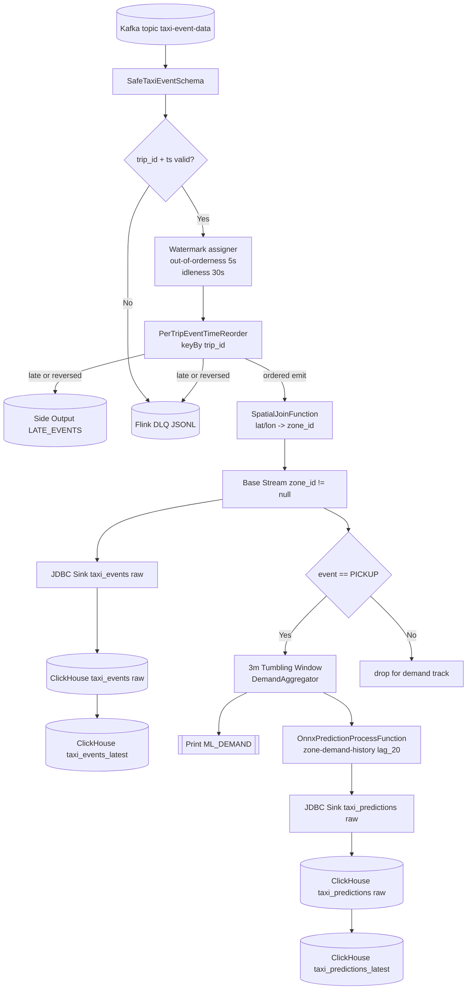

# Flink 데이터 흐름 설명 (한국어)

기준 흐름:

[Kafka: taxi-event-data] --(Kafka Source + Event-time Reorder)--> [Flink TaxiRealtimeJob] --(JDBC Sink)--> [ClickHouse Raw: taxi_events / taxi_predictions]  
                                                                            └--(MV + FINAL 조회)--> [ClickHouse Serving: taxi_events_latest / taxi_predictions_latest]

## 1. 입력: Kafka 토픽 소비
- Flink 잡은 `FLINK_KAFKA_BOOTSTRAP_SERVERS`로 Kafka 클러스터에 접속해 `taxi-event-data`를 읽습니다.
- consumer group 기본값은 `FLINK_KAFKA_GROUP_ID=taxi-realtime-flink`입니다.
- 소스 시작점은 `FLINK_KAFKA_START_OFFSETS`로 제어합니다. (`committed|earliest|latest`, 기본 `committed`)
- 메시지 스키마는 JSON `TaxiEvent`이며 핵심 키는 `trip_id`, `ts`, `event`, `lat`, `lon`입니다.
- 즉, Flink는 HTTP 요청을 직접 받지 않고 Kafka를 source로 소비하며, sink는 ClickHouse(`taxi_events`, `taxi_predictions`)입니다.

## 2. 실행 토폴로지: JobManager + TaskManager
- compose 기준 기본 구성은 `flink-jobmanager` 1대 + `flink-taskmanager` 3대입니다.
- 잡은 Application Mode(`standalone-job --job-classname com.example.TaxiRealtimeJob`)로 시작됩니다.
- Single-machine 기본값:
  - `FLINK_PARALLELISM=12`
  - TaskManager 3대 x `taskmanager.numberOfTaskSlots=4`
- Distributed 기본값:
  - `FLINK_PARALLELISM=12`
  - TaskManager 3대 x `taskmanager.numberOfTaskSlots=4`

## 3. 수신 직후 정제: 안전 역직렬화 + 필수 필드 검증
- `SafeTaxiEventSchema`가 역직렬화 예외를 잡고 실패 레코드는 `null`로 반환해 파이프라인 전체 중단을 막습니다.
- `ObjectMapper`는 unknown field를 무시(`FAIL_ON_UNKNOWN_PROPERTIES=false`)합니다.
- 역직렬화 실패/검증 실패는 Flink DLQ(JSONL)에 기록한 뒤 메인 파이프라인에서 drop됩니다.
  - 기본 경로: `/opt/flink/data/dead_letter_queue-<hostname>.jsonl`
  - fallback 경로: `/tmp/dead_letter_queue-<hostname>.jsonl` (`/opt/flink/data` 초기화 실패 시)
  - host bind mount 경로(compose 기준): `services/flink-job/data`
- raw filter 단계에서 아래 조건을 만족하지 못하면 `VALIDATION_FAILED`로 DLQ 기록됩니다.
  - `event == null`
  - `trip_id == null`
  - `ts == null`
  - `Instant.parse(ts)` 실패

## 4. 순서 보정: trip_id 단위 event-time 재정렬
- 워터마크는 `forBoundedOutOfOrderness(기본 5초)` + `withIdleness(기본 30초)`로 구성됩니다.
- `keyBy(trip_id)` 후 `PerTripEventTimeReorder`에서 키별 버퍼(`ListState`)와 마지막 배출 시각(`ValueState`)을 관리합니다.
- 각 이벤트는 `eventTs + latenessMs` 타이머 시점에 버퍼 소팅 후 순서대로 배출됩니다.
- 늦은 이벤트 처리:
  - `eventTs <= currentWatermark`면 `LATE_EVENTS` 사이드 아웃풋으로 보냅니다.
  - flush 중 `ts < lastEmittedTs`인 역전 이벤트도 `LATE_EVENTS`로 보냅니다.
  - 두 케이스 모두 `LATE_DROPPED` 카테고리로 DLQ(JSONL)에도 기록됩니다.
- idle cleanup:
  - 키별 마지막 처리시각 기준 기본 20분 비활성 시 상태를 정리합니다(`FLINK_IDLE_CLEANUP_MINUTES`).

## 4.1 Flink 내부 버퍼/상태 레이어
- `Ingestor`처럼 명시적 큐 이름은 적지만, Flink 내부에는 다음 버퍼/상태가 존재합니다.
- 재정렬 버퍼(state):
  - `PerTripEventTimeReorder`의 `ListState<TaxiEvent>`에 trip별 이벤트를 보관했다가 워터마크/타이머 시점에 flush합니다.
  - `lastEmittedTs`, `lastSeenProcTime`, `cleanupTimerProcTs` 같은 `ValueState`로 배출 순서와 idle cleanup을 관리합니다.
- 집계/예측 상태(state):
  - 3분 윈도우 집계는 window state를 유지합니다.
  - ONNX 예측 전 `zone-demand-history(ListState<Long>)`에 lag 히스토리를 누적합니다.
- Sink 배치 버퍼:
  - JDBC sink는 `FLINK_JDBC_BATCH_SIZE`, `FLINK_JDBC_BATCH_INTERVAL_MS` 기준으로 내부 배치 flush를 수행합니다.
- 런타임 네트워크 버퍼/백프레셔:
  - Source/Operator/Sink 사이에는 Flink network buffer가 동작하며, Sink가 느리면 upstream에 backpressure가 전파됩니다.

## 5. 도메인 가공: 좌표 -> zone_id 매핑
- `SpatialJoinFunction`이 `taxi_zone_median_coords.csv`를 로딩해 기준 좌표 목록을 메모리에 올립니다.
- 각 이벤트의 `lat/lon`과 모든 zone 좌표의 거리를 계산해 가장 가까운 `zone_id`를 부여합니다.
- `lat` 또는 `lon`이 없으면 `zone_id=-1`로 설정합니다.
- 이후 스트림에서 `zone_id != null` 조건으로 필터링합니다.

## 6. 트랙 1: 원본 이벤트 ClickHouse raw 적재 (`taxi_events`)
- base stream을 JDBC sink로 `taxi_events(trip_id, ts, zone_id, event)` raw 테이블에 적재합니다.
- `event` 값은 `normType()`으로 대문자/공백/언더스코어 정규화 후 저장됩니다.
- JDBC 실행 옵션:
  - `FLINK_JDBC_BATCH_SIZE` (기본 50000)
  - `FLINK_JDBC_BATCH_INTERVAL_MS` (기본 3000ms)
  - `withMaxRetries(5)`
- sink 병렬도는 `FLINK_CLICKHOUSE_SINK_PARALLELISM`(미설정 시 `FLINK_PARALLELISM`)을 따릅니다.
- `FLINK_ENABLE_CLICKHOUSE_SINK=false`면 이 트랙은 비활성화됩니다.
- 참고: raw 테이블은 JDBC at-least-once 재시도로 중복이 남을 수 있고, 조회는 `taxi_events_latest`를 기준으로 수행합니다.

## 7. 트랙 2: 3분 수요 집계 스트림
- base stream에서 `event == PICKUP`만 남겨 zone별 수요 집계를 만듭니다.
- `keyBy(zone_id)` 후 `TumblingEventTimeWindows.of(Time.minutes(windowDemandMinutes))`로 윈도우를 자릅니다.
- `DemandAggregator`가 윈도우 내 건수를 세고 `DemandWindowFn`이 `DemandRow(zone_id, window_end, count)`를 생성합니다.
- 집계 결과는 `demandRows.print()`로 로그에도 출력됩니다.
- 윈도우 길이는 `FLINK_WINDOW_DEMAND_MINUTES`(기본 3분)로 조정할 수 있습니다.

## 8. 트랙 3: ONNX 추론 + 예측 raw 적재 (`taxi_predictions`)
- `DemandRow`를 zone 단위로 다시 `keyBy`하고 `OnnxPredictionProcessFunction`을 적용합니다.
- zone별 `ListState<Long>`에 과거 수요를 저장하고, 기본 `lag_20`이 준비되면 예측을 수행합니다.
- ONNX 입력 피처:
  - `zone_id`
  - `hour`
  - `day_of_week` (월=0 ... 일=6)
  - `is_weekend`
  - `demand_lag_20`
- 출력값이 음수면 0으로 보정합니다.
- 예측 시각:
  - `prediction_time = window_end`
  - `target_time = prediction_time + horizonSteps * intervalMinutes` (기본 15분 후)
- 결과는 `taxi_predictions(prediction_time, target_time, zone_id, predicted_demand, model_version)` raw 테이블로 적재됩니다.
- `FLINK_ENABLE_PREDICTION_SINK=false`면 예측 트랙을 건너뜁니다.
- 조회/대시보드 기준은 `taxi_predictions_latest`를 권장합니다.

## 9. 전체 흐름을 한 줄로 요약
1. Kafka에서 원시 이벤트를 읽는다.  
2. 역직렬화/필드 검증 후 trip 단위로 event-time 재정렬한다.  
3. 좌표를 zone으로 매핑한 뒤 원본 이벤트를 `taxi_events` raw 테이블로 저장한다.  
4. `PICKUP` 이벤트를 3분 윈도우로 집계해 zone 수요 스트림을 만든다.  
5. lag 상태가 쌓이면 ONNX로 수요를 예측해 `taxi_predictions` raw 테이블로 저장하고, 조회는 `*_latest` 뷰를 사용한다.

## 10. 단계별 실행 타임라인 (순서 중심)
1. 컨테이너 시작  
   JobManager가 `standalone-job`로 `TaxiRealtimeJob`을 실행합니다.
2. 런타임 설정 로드  
   `FLINK_*` env를 읽어 parallelism/topic/sink/model 경로를 확정합니다.
3. 체크포인트 활성화  
   30초 주기의 `EXACTLY_ONCE` 체크포인트 설정을 적용합니다.
4. KafkaSource 생성  
   bootstrap/topic/groupId/starting offset을 지정합니다.
5. 안전 역직렬화  
   파싱 불가 JSON은 에러 카운팅 후 `DESERIALIZATION_FAILED`로 DLQ에 기록하고 drop합니다.
6. 필수 필드 필터  
   `trip_id`, `ts` 누락/파싱 실패 이벤트를 `VALIDATION_FAILED`로 DLQ에 기록하고 제거합니다.
7. trip 단위 재정렬  
   워터마크 기준으로 버퍼를 flush하고 late 이벤트를 사이드 아웃풋으로 분리합니다. late 이벤트는 `LATE_DROPPED`로 DLQ에도 기록합니다.
8. 공간 매핑  
   `lat/lon -> nearest zone_id`를 계산합니다.
9. 원본 싱크 적재  
   정제 이벤트를 JDBC batch로 `taxi_events`에 씁니다.
10. 3분 수요 집계  
    `PICKUP`만 집계해 `DemandRow`를 만듭니다.
11. ONNX 예측  
    lag 상태가 준비된 zone에 대해 `target_time` 수요를 예측합니다.
12. 예측 싱크 적재  
    `taxi_predictions` 테이블에 예측 결과를 JDBC batch로 저장합니다.

## 11. 데이터 객체 이동 맵 (어디서 -> 어디로)
| 단계 | 어디에 있음 | 데이터 형태 | 다음 이동 |
|---|---|---|---|
| 1 | Kafka topic `taxi-event-data` | JSON bytes | `SafeTaxiEventSchema` |
| 2 | Source 역직렬화 | `TaxiEvent` 또는 `null` | raw filter / DLQ(`DESERIALIZATION_FAILED`) |
| 3 | raw filter 이후 | 유효 `TaxiEvent` | `keyBy(trip_id)` |
| 4 | 재정렬 오퍼레이터 상태 | `ListState<TaxiEvent>`, `ValueState<Long>` | ordered stream 또는 `LATE_EVENTS` + DLQ(`LATE_DROPPED`) |
| 5 | `SpatialJoinFunction` | `TaxiEvent(zone_id 부여)` | base stream |
| 6 | Track 1 JDBC sink | `INSERT taxi_events` 레코드 | ClickHouse raw `taxi_events` |
| 7 | Track 2 window | `DemandRow(zone_id, window_end, count)` | print + prediction track |
| 8 | ONNX process state | `zone-demand-history(ListState<Long>)` | `PredictionRow` |
| 9 | Track 3 JDBC sink | `INSERT taxi_predictions` 레코드 | ClickHouse raw `taxi_predictions` |
| 10 | Flink DLQ file | JSONL (`DESERIALIZATION_FAILED`/`VALIDATION_FAILED`/`LATE_DROPPED`) | 운영 점검/수동 재처리 |
| 11 | ClickHouse MV | `mv_taxi_events_to_serving`, `mv_taxi_predictions_to_serving` | serving 테이블 |
| 12 | ClickHouse serving view | `taxi_events_latest`, `taxi_predictions_latest` (`FINAL`) | 운영 조회/대시보드 |

## 12. Flink가 실제로 관리하는 것
1. 이벤트 시간 기준 순서성  
   `watermark + per-key timer`로 out-of-order를 완화합니다.
2. 상태 기반 복원력  
   reorder/history 상태와 체크포인트로 장애 시 복구 기반을 제공합니다.
3. 다중 트랙 fan-out  
   같은 base stream을 원본 적재와 수요/예측 트랙으로 동시에 분기합니다.
4. 배치 싱크 효율  
   JDBC batch 크기/주기로 ClickHouse write 증폭을 줄입니다.
5. 모델 추론 파이프라인  
   집계 -> feature 생성 -> ONNX 추론 -> 예측 저장을 스트림 내부에서 완료합니다.
6. 조회 정합성 분리  
   sink(raw)와 조회(serving)를 분리해 재시도 중복 영향을 운영 조회에서 완화합니다.

## 13. 전체 흐름 (Mermaid)

해석 포인트:
- `LATE_EVENTS`는 현재 코드에서 print sink가 주석 처리되어 있어 기본 실행 로그에는 직접 나타나지 않습니다.
- 대신 drop/실패 이벤트는 DLQ(JSONL)에 남습니다. (기본 `/opt/flink/data`, 실패 시 `/tmp`)
- 호스트에서 파일을 확인할 때는 compose 기준 `services/flink-job/data/dead_letter_queue-*.jsonl`를 확인하면 됩니다.
- 예측은 zone별 `lag_20` 상태가 채워진 뒤에만 생성되므로, 잡 시작 직후 `taxi_events`만 증가하는 구간이 정상적으로 발생할 수 있습니다.
- ONNX 모델 파일은 Flink 실행 노드(특히 TaskManager)에서 `FLINK_ONNX_MODEL_PATH`로 접근 가능해야 하며, 경로 누락 시 오퍼레이터 초기화 단계에서 실패합니다.
- raw 테이블(`taxi_events`, `taxi_predictions`)은 중복 가능성이 있으므로 운영 조회는 `taxi_events_latest`, `taxi_predictions_latest` 기준으로 보는 것이 안전합니다.
