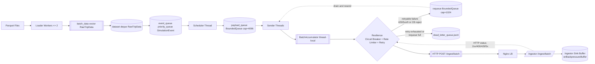

# Generator 데이터 흐름 설명 (한국어)

기준 흐름:

[Parquet Files] --(Apache Arrow)--> [Generator] --(HTTP POST/JSON Batches)--> [Nginx LB] --> [Ingestor Cluster]

## 1. 입력: Parquet 파일 로드
- Generator는 `data/taxi_data_preprocessed` 경로에서 날짜 범위에 맞는 `.parquet` 파일을 찾습니다.
- 로드는 멀티스레드입니다. 파일 단위로 worker를 띄워 병렬 처리합니다(최대 2개).
- 각 worker 내부에서는 Apache Arrow/Parquet 리더로 row group, record batch를 순차적으로 읽습니다.
- 각 row를 `RawTripData` 구조체로 변환합니다.
- 각 trip마다 기본 이벤트 2개를 우선순위 큐에 넣습니다.
  - `PICKUP`
  - `DROPOFF`

## 2. 스케줄링: 시뮬레이션 시간으로 이벤트 방출
- 스케줄러 스레드가 우선순위 큐(가장 빠른 이벤트 시간 우선)를 계속 확인합니다.
- 현재 벽시계 시간과 `playback_speed`를 이용해 “현재 시뮬레이션 시각”을 계산합니다.
- 이벤트 시간이 도달하면 JSON payload를 만들고 `payload_queue`에 push합니다.
- `IN_TRANSIT` 이벤트는 미리 전부 만들지 않고, 이벤트 처리 시점에 30초 간격으로 lazy 생성합니다.
- 아직 시간이 안 된 이벤트는 busy-wait 대신 `sleep/yield` 전략으로 대기합니다.

## 3. 배치 전송 준비: Sender 스레드 풀
- 여러 Sender 스레드가 `payload_queue`를 소비합니다.
- 각 Sender는 자기 `BatchAccumulator`를 갖고 이벤트를 모읍니다.
- 배치 flush 조건:
  - 배치 크기 `batch_size` 도달 (기본 200)
  - 배치 대기시간 `batch_timeout_ms` 도달 (기본 100ms, best-effort)
- flush 시 배치를 한 번에 HTTP 전송합니다.

## 4. 실제 전송 경로: Generator -> Nginx -> Ingestor
- Generator는 배치를 JSON 배열로 묶어 `/ingest/batch`로 POST합니다.
- 요청은 먼저 Nginx LB로 들어갑니다.
- Nginx가 ingestor 인스턴스(여러 대) 중 한 곳으로 분산 전달합니다.
- 즉, Generator는 “ingestor 클러스터”와 직접 각각 통신하는 게 아니라 Nginx를 통해 간접 통신합니다.

## 5. 전송 제어 로직 (Resilience)
- 전송 직전/직후에 아래 로직이 순서대로 적용됩니다.

### 5-1. Circuit Breaker
- 서버 상태가 나쁘다고 판단되면 요청을 막고 재큐잉/ DLQ로 보냅니다.
- 실패 판정은 `status_code == 0` 또는 `status_code >= 500` 기준입니다.
- 상태 전이:
  - `CLOSED -> OPEN -> HALF_OPEN -> CLOSED`

### 5-2. Rate Limiter
- 최근 429 비율을 보고 지연 시간을 동적으로 조정합니다.
- 429 발생 시 지연 증가(백오프), 성공 응답 누적 시 지연 감소(회복).
- 지연은 요청 전에 `sleep`으로 반영됩니다.

### 5-3. Retry / Requeue / DLQ
- 재시도 가능한 실패(`429`, `5xx`, 소켓 오류)는 requeue로 다시 보냅니다.
- 재시도 한도를 넘기거나 requeue가 가득 차면 DLQ 파일(`dead_letter_queue.jsonl`)에 기록합니다.
- 클라이언트 오류(일반 4xx)는 재시도 없이 드롭합니다.

## 6. 배치 실패 처리 규칙
- `2xx`: 성공 처리
- `400`: 배치를 개별 이벤트로 분해해서 단건 재처리 (문제 이벤트 분리 목적)
- `429/5xx/0`: 배치 내 각 이벤트를 개별 재큐잉
- 기타 `4xx`: 드롭

## 7. 전체 흐름을 한 줄로 요약
1. Parquet를 읽어 이벤트 큐를 만든다.  
2. 스케줄러가 시뮬레이션 시각에 맞춰 payload를 생성한다.  
3. Sender가 payload를 배치로 모아 `/ingest/batch`로 보낸다.  
4. 요청은 Nginx LB를 거쳐 Ingestor Cluster로 분산된다.  
5. 실패 시 circuit breaker/rate limiter/retry/DLQ 로직으로 안정성을 유지한다.

## 8. 단계별 실행 타임라인 (순서 중심)
1. Parquet 로드 시작  
   파일 목록을 찾고 worker(최대 2개)가 파일 단위로 나눠 읽는다.
2. row -> `RawTripData` 변환  
   각 row를 도메인 구조체로 만든다.
3. trip seed 이벤트 적재  
   각 trip마다 `PICKUP`, `DROPOFF`를 `event_queue`(우선순위 큐)에 넣는다.
4. 스케줄러 시작  
   `sim_start_ts`를 기준으로 `current_sim_ts`를 계속 계산한다.
5. 이벤트 발사 조건 검사  
   `current_sim_ts >= event_time`이면 해당 이벤트를 처리한다.
6. payload 생성 후 큐 전달  
   이벤트를 JSON으로 만들고 `payload_queue`에 push한다.
7. 중간 이동 이벤트 lazy 생성  
   이벤트가 `PICKUP` 또는 `IN_TRANSIT`이면, 30초 뒤 `IN_TRANSIT`를 다시 `event_queue`에 넣는다(드롭오프 전까지 반복).
8. Sender 배치 수집  
   Sender 스레드가 `payload_queue`에서 꺼내 `BatchAccumulator`에 모은다.
9. 배치 flush/전송  
   배치 크기 또는 시간 조건이 맞으면 `/ingest/batch`로 HTTP POST한다.
10. Nginx 분산 전달  
    Nginx LB가 ingestor replica 중 한 곳으로 요청을 전달한다.
11. 응답 코드 기반 후처리  
    성공이면 종료, 실패면 requeue 또는 DLQ로 이동한다.
12. 종료 단계  
    scheduler가 `payload_queue.close()` 후 sender가 남은 배치/재시도를 정리하고 종료한다.

## 9. 데이터 객체 이동 맵 (어디서 -> 어디로)
| 단계 | 어디에 있음 | 데이터 형태 | 다음 이동 |
|---|---|---|---|
| 1 | `data/taxi_data_preprocessed/*.parquet` | Parquet row | Loader worker가 읽음 |
| 2 | loader worker 메모리 | `RawTripData` | `sim.ingest_trips()`로 전달 |
| 3 | simulator 내부 `dataset` + `event_queue` | `RawTripData` 참조 + `SimulationEvent(PICKUP/DROPOFF)` | scheduler가 pop |
| 4 | scheduler 스레드 | `SimulationEvent` | `build_payload()` 호출 |
| 5 | scheduler 스레드 | JSON 문자열 (`payload`) + retry 정보 | `payload_queue`로 push |
| 6 | sender 스레드 로컬 | `BatchAccumulator<vector<PayloadWithRetry>>` | flush 시 batch 전송 |
| 7 | sender 스레드 | JSON 배열 문자열 (`[event1,event2,...]`) | HTTP `/ingest/batch` |
| 8 | Nginx LB | HTTP 요청 | ingestor replica로 프록시 |
| 9 | Ingestor | 배치 이벤트 | 응답 코드 반환 (`2xx/4xx/5xx`) |
| 10 | sender 후처리 | 성공/실패 상태 | 성공 종료 or `requeue`/`DLQ` |
| 11 | `requeue` 큐 | 재시도 이벤트 | 재전송 시도(개별 전송 경로) |
| 12 | `dead_letter_queue.jsonl` | 최종 실패 이벤트 로그 | 수동 재처리 대상 |

## 10. 스케줄러가 실제로 관리하는 것
1. 시간축 관리  
   벽시계 시간과 `playback_speed`로 시뮬레이션 시간을 계산한다.
2. 순서성 관리  
   `event_queue` 최소 시각 이벤트부터 처리해서 이벤트 시간 순서를 보장한다.
3. 생성량 제어  
   `IN_TRANSIT`를 즉시 전부 만들지 않고 필요 시점에만 추가한다.
4. 백프레셔 반영  
   `payload_queue.push()`가 막히면 스케줄러도 대기해 전송 속도에 자연히 맞춰진다.

## 11. 전체 큐/버퍼 흐름 (Mermaid)

해석 포인트:
- `event_queue`는 스케줄링 큐, `payload_queue`는 1차 전송 큐, `requeue`는 재시도 큐입니다.
- `requeue`는 현재 구현에서 `payload_queue` 처리 종료 이후 drain되며 재전송됩니다.
- Ingestor에서 `FAIL_OVERFLOW`가 나면 배치 응답이 `429`가 되고, generator의 재시도 경로로 되돌아옵니다.
