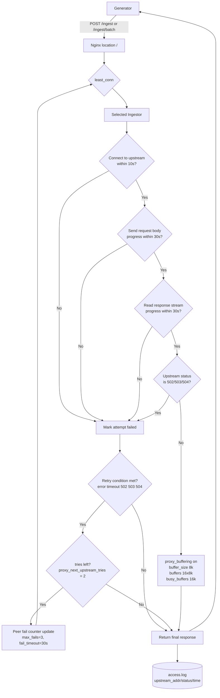

# Nginx 데이터 흐름 설명 (한국어)

기준 흐름:

[Generator] --(HTTP POST /ingest, /ingest/batch)--> [Nginx LB] --(HTTP proxy_pass + least_conn)--> [Ingestor Cluster]

## 1. 입력: Nginx LB로 요청 유입
- 외부에서 들어온 요청은 `NGINX_LB_PORT`로 수신되고, 컨테이너 내부 `80` 포트로 전달됩니다.
- Generator의 배치 요청은 주로 `POST /ingest/batch`로 들어오고, 필요 시 `POST /ingest`도 동일 경로로 처리됩니다.
- 요청 본문 크기는 `client_max_body_size 10m` 제한을 받습니다.

## 2. 업스트림 풀 구성
- Nginx는 `upstream ingestors`에 ingestor 3대를 등록합니다.
- Single-machine:
  - `ingestor-1:8080`
  - `ingestor-2:8080`
  - `ingestor-3:8080`
- Distributed:
  - `${INGESTOR_1_IP}:${INGESTOR_1_PORT}`
  - `${INGESTOR_2_IP}:${INGESTOR_2_PORT}`
  - `${INGESTOR_3_IP}:${INGESTOR_3_PORT}`
- Distributed 모드는 컨테이너 시작 시 `envsubst`로 템플릿을 실제 `nginx.conf`로 렌더링합니다.

## 3. 분산 라우팅: least_conn
- `location`은 “요청 URL 경로를 어떤 규칙으로 처리할지”를 정하는 블록입니다.
- `location /`는 루트 경로 규칙이라 `/ingest`, `/ingest/batch`를 포함한 대부분 요청이 여기에 매칭됩니다.
- 이 블록에서 `proxy_pass http://ingestors`를 실행해 요청을 ingestor 클러스터로 넘깁니다.
- 라우팅 정책은 `least_conn`입니다.
  - 여기서 말하는 “연결 수”는 누적 요청 수가 아니라, **현재 처리 중인(active) upstream 연결/요청 수**에 가깝습니다.
  - 즉 그 순간 덜 바쁜 ingestor를 우선 선택합니다.
- upstream keepalive 풀(`keepalive 32`)은 기존 TCP 연결을 재사용하기 위한 설정입니다.
  - 새 요청마다 TCP handshake를 다시 하지 않고, 놀고 있는 연결이 있으면 재사용합니다.
  - 없으면 새 연결을 만들고, 이후 idle 상태가 되면 풀에 보관했다가 다시 씁니다.

## 4. 프록시 전달 시 헤더/타임아웃/버퍼 처리
- 전달 헤더:
  - `Host`
  - `X-Real-IP`
  - `X-Forwarded-For`
  - (single-machine에서만) `X-Forwarded-Proto`
- 헤더를 넣는 이유:
  - backend(ingestor)가 “원래 어떤 호스트로, 어떤 클라이언트가, 어떤 프로토콜로 들어왔는지”를 알게 하려는 목적입니다.
  - `X-Real-IP`는 단일 원본 IP, `X-Forwarded-For`는 프록시 체인의 IP 목록입니다.
- 타임아웃:
  - `proxy_connect_timeout 10s`
  - `proxy_send_timeout 30s`
  - `proxy_read_timeout 30s`
- 타임아웃 의미:
  - `proxy_connect_timeout`: upstream TCP 연결 시작이 10초 안 되면 실패
  - `proxy_send_timeout`: upstream으로 요청 바디를 보내는 동안 30초 이상 진전이 없으면 실패
  - `proxy_read_timeout`: upstream 응답을 읽는 동안 30초 이상 새 데이터가 없으면 실패
  - 즉 “총 요청 시간”보다 “I/O 정체 시간” 기준에 가깝습니다.
- 버퍼:
  - `proxy_buffering on`
  - `proxy_buffer_size 8k`
  - `proxy_buffers 16 8k`
  - `proxy_busy_buffers_size 16k`
- 버퍼 의미:
  - `proxy_buffering on`: 응답을 받는 즉시 전부 흘려보내기보다 Nginx가 중간에서 완충합니다.
  - `proxy_buffer_size 8k`: 첫 응답 조각(주로 헤더) 버퍼
  - `proxy_buffers 16 8k`: 본문 버퍼(총 128KB)
  - `proxy_busy_buffers_size 16k`: 클라이언트로 전송 중인 busy 버퍼 허용량
  - 효과적으로는 느린 클라이언트가 있어도 upstream을 오래 붙잡지 않도록 돕습니다.

## 5. 실패 처리: passive failover + next upstream
- Nginx는 active health check를 수행하지 않습니다.
- 대신 요청 처리 중 실패를 기준으로 우회합니다.

### 5-1. 즉시 우회 조건
- `error`, `timeout`, `http_502`, `http_503`, `http_504` 발생 시 다른 upstream으로 재시도합니다.
- 재시도 최대 횟수는 `proxy_next_upstream_tries 2`입니다.

### 5-2. 업스트림 일시 제외
- 특정 upstream이 반복 실패하면 `max_fails=3 fail_timeout=30s` 규칙으로 passive하게 제외됩니다.
- 즉, 실패 누적이 임계치를 넘으면 일정 시간 해당 peer를 피해서 라우팅합니다.

## 6. `/health` 경로 동작 차이
- Single-machine 설정:
  - `location /health`는 Nginx가 직접 `200 OK`를 반환합니다.
  - 이 응답은 LB 프로세스 생존 확인용이며 ingestor 상태와 분리됩니다.
- Distributed 템플릿:
  - `/health` 전용 location이 없어 `location /`으로 처리되어 upstream ingestor로 프록시됩니다.

## 7. 전체 흐름을 한 줄로 요약
1. Generator 요청이 Nginx LB로 들어온다.  
2. Nginx가 `least_conn`으로 ingestor를 선택한다.  
3. 프록시 타임아웃/버퍼 정책으로 요청을 전달한다.  
4. 실패 시 `proxy_next_upstream`과 passive failover 규칙으로 다른 ingestor로 우회한다.  
5. 최종 응답 코드를 Generator에 반환하고 access log에 upstream 메타데이터를 남긴다.

## 8. 단계별 실행 타임라인 (순서 중심)
1. 클라이언트 연결 수락  
   `NGINX_LB_PORT -> container:80`으로 요청 수신.
2. URI 매칭  
   single-machine은 `/health`와 그 외 경로를 분기, distributed는 `location /` 단일 처리.
3. 업스트림 후보 선택  
   `least_conn`으로 ingestor 후보 결정.
4. 백엔드 연결 확보  
   keepalive 연결 재사용 또는 신규 연결 생성.
5. 요청 전달  
   헤더를 세팅하고 ingestor로 프록시 전송.
6. 응답 대기  
   `proxy_read_timeout` 내 응답을 기다림.
7. 실패 판단  
   timeout/502/503/504/연결오류면 재시도 조건 충족.
8. 우회 재시도  
   남은 tries가 있으면 다른 upstream으로 전달.
9. 최종 응답 반환  
   성공 또는 최종 실패 상태를 클라이언트에 반환.
10. 로그 기록  
    `upstream_addr`, `upstream_status`, `request_time`, `upstream_response_time`를 access log에 남김.

## 9. 데이터 객체 이동 맵 (어디서 -> 어디로)
| 단계 | 어디에 있음 | 데이터 형태 | 다음 이동 |
|---|---|---|---|
| 1 | Generator | HTTP 요청 + JSON body | Nginx listener(`:80`) |
| 2 | Nginx server block | parsed request metadata + body | `location /` 매칭 |
| 3 | Nginx upstream selector | upstream peer 후보 목록 | `least_conn` 선택 결과 |
| 4 | Nginx <-> Ingestor 연결 | proxied HTTP request | 선택된 ingestor로 전달 |
| 5 | Ingestor | `/ingest` 또는 `/ingest/batch` 처리 결과 | HTTP status/body 반환 |
| 6 | Nginx response path | upstream status + response body | Generator로 응답 전달 |
| 7 | Nginx access log | 요청/응답/업스트림 메타데이터 | `/var/log/nginx/access.log` 기록 |

## 10. Nginx가 실제로 관리하는 것
1. 연결 수준 동시성  
   `worker_connections` 범위 안에서 다수 요청을 이벤트 기반으로 처리합니다.
2. 업스트림 상태 추정  
   `max_fails`와 `fail_timeout`으로 peer 실패를 수동(passive) 추적합니다.
3. 재시도 정책  
   어떤 실패를 다른 peer로 넘길지(`proxy_next_upstream`)를 결정합니다.
4. 프록시 버퍼링  
   응답 버퍼 파라미터로 I/O burst를 흡수합니다.

## 11. 전체 흐름 (Mermaid)

해석 포인트:
- Nginx는 요청 단위로 라우팅/우회를 수행하고, 애플리케이션 레벨 큐나 재처리 저장소(DLQ)는 관리하지 않습니다.
- timeout 기준은 총 요청 시간보다 connect/send/read 구간의 I/O 정체 시간에 가깝습니다.
- 장애 대응은 active probe가 아니라 요청 실패 신호 기반(passive)이며, 실패 시 조건이 맞으면 다른 upstream으로 재시도합니다.
- single-machine의 `/health`는 Nginx 자체 생존 체크이며, distributed에서는 upstream health endpoint 프록시 결과에 의존합니다.
