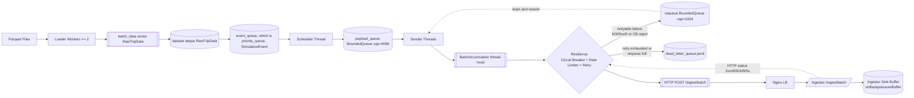
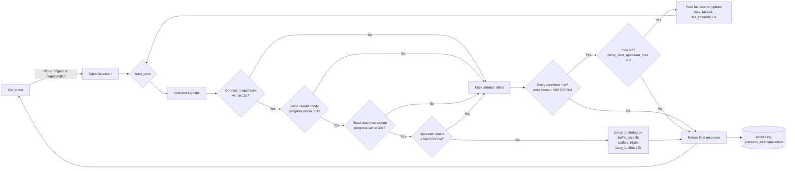
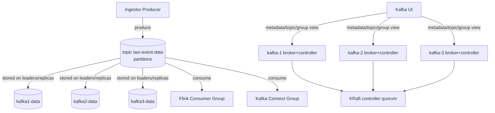

# Multi Orchestration (현 진행 상황)

[Idea on logging (재영 / 전체)](https://www.notion.so/Idea-on-logging-30b8360423c980d7a9a6e7ddfcf7acd7?pvs=21)

[log 전문가 지선생 (지피티 아님)](https://www.notion.so/log-30c8360423c980b7a116ee590259af68?pvs=21)

## Parquet data

### Introduction on the data

Newyork Yellow cab taxi data (2011 ~ 2025)

⇒ 데이터 셋에 대한 설명도 필요

### Test data set

실험할 데이터 범위 2024.01 ~ 2024.12

현재 데이터 크기 : 0.7GB (parquet 기준), 40,742,331 Row

@ 현재 실험할 데이터에 대해 간단 시각화 자료를 부탁드립니다.

### Generated Data via generator

Pick Up :  40,742,331

In Transit : 1,394,015,622

Drop off : 40,742,331

⇒ Total : 1,475,500,284 events / 187GB (json payload 기준)

Average expected throughput per second (total event / 1 year in second)

⇒ 1,475,500,284 / 31536000 $\approx$ 47 events per second 

## Generator

parquet 데이터를 로드하고 이를 Nginx 서버를 통해 Ingestion server로 전송하는 역할을 수행한다.

데이터는 Wall time clock을 기준으로 발신이 된다. 이때 config를 통해 보내는 rate를 조절할 수 있다.

코드는 cpp로 작성되어있다.

실제 데이터 흐름은 아래와 같다.

[Parquet Files] --(Apache Arrow)--> [Generator] --(HTTP POST/JSON Batches)--> [Nginx LB] --> [Ingestor Cluster]

그렇다면 데이터가 실제로 어떻게 흐르고 어떤 로직을 통해서 전송이 되는지 알아보자.

```markdown
# Generator 데이터 흐름 설명

기준 흐름:

[Parquet Files] --(Apache Arrow)--> [Generator] --(HTTP POST/JSON Batches)--> [Nginx LB] --> [Ingestor Cluster]

## 1. 입력: Parquet 파일 로드
- Generator는 `data/taxi_data_preprocessed` 경로에서 날짜 범위에 맞는 `.parquet` 파일을 찾습니다.
- 로드는 멀티스레드입니다. 파일 단위로 worker를 띄워 병렬 처리합니다(최대 2개).
- 각 worker 내부에서는 Apache Arrow/Parquet 리더로 row group, record batch를 순차적으로 읽습니다.
- 각 row를 `RawTripData` 구조체로 변환합니다.
- 각 trip마다 기본 이벤트 2개를 우선순위 큐에 넣습니다.
  - `PICKUP`
  - `DROPOFF`

## 2. 스케줄링: 시뮬레이션 시간으로 이벤트 방출
- 스케줄러 스레드가 우선순위 큐(가장 빠른 이벤트 시간 우선)를 계속 확인합니다.
- 현재 벽시계 시간과 `playback_speed`를 이용해 “현재 시뮬레이션 시각”을 계산합니다.
- 이벤트 시간이 도달하면 JSON payload를 만들고 `payload_queue`에 push합니다.
- `IN_TRANSIT` 이벤트는 미리 전부 만들지 않고, 이벤트 처리 시점에 30초 간격으로 lazy 생성합니다.
- 아직 시간이 안 된 이벤트는 busy-wait 대신 `sleep/yield` 전략으로 대기합니다.

## 3. 배치 전송 준비: Sender 스레드 풀
- 여러 Sender 스레드가 `payload_queue`를 소비합니다.
- 각 Sender는 자기 `BatchAccumulator`를 갖고 이벤트를 모읍니다.
- 배치 flush 조건:
  - 배치 크기 `batch_size` 도달 (기본 200)
  - 배치 대기시간 `batch_timeout_ms` 도달 (기본 100ms, best-effort)
- flush 시 배치를 한 번에 HTTP 전송합니다.

## 4. 실제 전송 경로: Generator -> Nginx -> Ingestor
- Generator는 배치를 JSON 배열로 묶어 `/ingest/batch`로 POST합니다.
- 요청은 먼저 Nginx LB로 들어갑니다.
- Nginx가 ingestor 인스턴스(여러 대) 중 한 곳으로 분산 전달합니다.
- 즉, Generator는 “ingestor 클러스터”와 직접 각각 통신하는 게 아니라 Nginx를 통해 간접 통신합니다.

## 5. 전송 제어 로직 (Resilience)
- 전송 직전/직후에 아래 로직이 순서대로 적용됩니다.
- 결국은 배치의 상태는 6번에 따라 배치 전송 처리상태를 알려주는 것이다.
- 그러면 해당 상태에 따라 5-1, 5-2, 5-3의 방식으로 분기해서 처리를 하는 것이다.

### 5-1. Circuit Breaker
- 서버 상태가 나쁘다고 판단되면 요청을 막고 재큐잉/ DLQ로 보냅니다. 
- 재시도 횟수가 3회미만 일때는 재큐잉이 되고 이를 넘을시 DLQ로 감
- 실패 판정은 `status_code == 0` 또는 `status_code >= 500` 기준입니다.
- 상태 전이:
	- `CLOSED : 정상`, `OPEN : 30초 동안 차단`, `HALF_OPEN : CLOSED로 가기 전에 test 해보는 state`
  - `CLOSED -> OPEN -> HALF_OPEN -> CLOSED`

### 5-2. Rate Limiter
- 최근 429 비율을 보고 지연 시간을 동적으로 조정합니다.
- 429 : ingestion buffer overflow
- 429 발생 시 지연 증가(백오프), 성공 응답 누적 시 지연 감소(회복).
- 지연은 요청 전에 `sleep`으로 반영됩니다.
- 작동 방식
	1. 429 한 번 받으면 current_delay를 10ms로 설정
	2. 다음 요청 전 sleep(10ms) 후 전송
	3. 또 429 받으면 delay를 1.5배로 키움 (10 -> 15 -> 22.5 -> ..., 구현은 정수 us라 반올림/절삭됨)
	4. 이걸 반복하다가 최대 5000ms(기본값)에서 캡
	5. 그리고 2xx가 나오기 시작하면(최근 429 비율이 threshold 미만일 때) 0.9배씩 줄여갑니다.

### 5-3. Retry / Requeue / DLQ
- 재시도 가능한 실패(`429`, `5xx`, 소켓 오류)는 requeue로 다시 보냅니다.
- 재시도 한도를 넘기거나 requeue가 가득 차면 DLQ 파일(`dead_letter_queue.jsonl`)에 기록합니다.
- 클라이언트 오류(일반 4xx)는 재시도 없이 드롭합니다.

## 6. 배치 실패 처리 규칙
- `2xx`: 성공 처리
- `400`: 배치를 개별 이벤트로 분해해서 단건 재처리 (문제 이벤트 분리 목적)
- `429/5xx/0`: 배치 내 각 이벤트를 개별 재큐잉
- 기타 `4xx`: 드롭

## 7. 전체 흐름을 한 줄로 요약
1. Parquet를 읽어 이벤트 큐를 만든다.  
2. 스케줄러가 시뮬레이션 시각에 맞춰 payload를 생성한다.  
3. Sender가 payload를 배치로 모아 `/ingest/batch`로 보낸다.  
4. 요청은 Nginx LB를 거쳐 Ingestor Cluster로 분산된다.  
5. 실패 시 circuit breaker/rate limiter/retry/DLQ 로직으로 안정성을 유지한다.

```

그럼 데이터가 어떻게 흐르는지 시각화를 해보자



## Nginx

Nginx는 generator의 HTTP ingest 트래픽을 ingestion cluster에 분배하는 역할을 한다. 

그리고 ingestion cluster의 응답도 관리해서 generator에 되돌려주는 역할 또한 한다.

추가적으로 generator 측의 로직과는 달리 자체적인 요청 우회 로직도 있음

내부적으로 트래픽 분배는 아래와 같이 진행이 된다.

```markdown
# Nginx 데이터 흐름 설명

기준 흐름:

[Generator] --(HTTP POST /ingest, /ingest/batch)--> [Nginx LB] --(HTTP proxy_pass + least_conn)--> [Ingestor Cluster]

## 1. 입력: Nginx LB로 요청 유입
- 외부에서 들어온 요청은 `NGINX_LB_PORT`로 수신되고, 컨테이너 내부 `80` 포트로 전달됩니다.
- Generator의 배치 요청은 주로 `POST /ingest/batch`로 들어오고, 필요 시 `POST /ingest`도 동일 경로로 처리됩니다.
- 요청 본문 크기는 `client_max_body_size 10m` (10mb) 제한을 받습니다.

## 2. 업스트림 풀 구성
- Nginx는 `upstream ingestors`에 ingestor 3대를 등록합니다.
- Single-machine:
  - `ingestor-1:8080`
  - `ingestor-2:8080`
  - `ingestor-3:8080`
- Distributed:
  - `${INGESTOR_1_IP}:${INGESTOR_1_PORT}`
  - `${INGESTOR_2_IP}:${INGESTOR_2_PORT}`
  - `${INGESTOR_3_IP}:${INGESTOR_3_PORT}`
- Distributed 모드는 컨테이너 시작 시 `envsubst`로 템플릿을 실제 `nginx.conf`로 렌더링합니다.

## 3. 분산 라우팅: least_conn
- 요청이 `location /`에 매칭되면 `proxy_pass http://ingestors`로 전달됩니다.
- 라우팅 정책은 `least_conn`입니다.
  - 현재 연결 수가 가장 적은 ingestor를 우선 선택합니다. (그니까 one with least request)
- upstream keepalive 풀(`keepalive 32`)을 사용해 백엔드 연결 재사용을 유도합니다.

## 4. 프록시 전달 시 헤더/타임아웃/버퍼 처리
- 전달 헤더:
  - `Host`
  - `X-Real-IP`
  - `X-Forwarded-For`
  - (single-machine에서만) `X-Forwarded-Proto`
- 헤더를 넣는 이유:
  - backend(ingestor)가 “원래 어떤 호스트로, 어떤 클라이언트가, 어떤 프로토콜로 들어왔는지”를 알게 하려는 목적입니다.
  - `X-Real-IP`는 단일 원본 IP, `X-Forwarded-For`는 프록시 체인의 IP 목록입니다.
  
- 타임아웃:
  - `proxy_connect_timeout 10s`: upstream TCP 연결 시작이 10초 안 되면 실패
  - `proxy_send_timeout 30s`: upstream으로 요청 바디를 보내는 동안 30초 이상 진전이 없으면 실패
  - `proxy_read_timeout 30s`: upstream 응답을 읽는 동안 30초 이상 새 데이터가 없으면 실패
- 타임아웃 의미: 총 요청 시간”보다 “I/O 정체 시간” 기준에 가깝습니다. 
=> 쉽게 말하면 이제 nginx에서 ingestor로 보낼때 네트워크상 문제가 생기면 timeout을 발생시킨다는 것
=> 이럴경우 어떻게 대응 하는지는 5번에서 나옴

- 버퍼:
  - `proxy_buffering on`: 응답을 받는 즉시 전부 흘려보내기보다 Nginx가 중간에서 완충합니다.
  - `proxy_buffer_size 8k`: 첫 응답 조각(주로 헤더) 버퍼
  - `proxy_buffers 16 8k`: 본문 버퍼(총 128KB)
  - `proxy_busy_buffers_size 16k`: 클라이언트로 전송 중인 busy 버퍼 허용량
- 버퍼 의미: 느린 클라이언트가 있어도 upstream을 오래 붙잡지 않도록 돕습니다.
- 그니까 ingestion의 답변을 buffer에 담아두고 generator로 보낸다고 이해를 하면 된다.

## 5. 실패 처리: passive failover + next upstream
- Nginx는 active health check를 수행하지 않습니다.
- 대신 요청 처리 중 실패를 기준으로 우회합니다.

### 5-1. 즉시 우회 조건
- `error`, `timeout`, `http_502`, `http_503`, `http_504` 발생 시 다른 upstream으로 재시도합니다.
- 재시도 최대 횟수는 `proxy_next_upstream_tries 2`입니다.

### 5-2. 업스트림 일시 제외
- 특정 upstream이 반복 실패하면 `max_fails=3 fail_timeout=30s` 규칙으로 passive하게 제외됩니다.
- 즉, 실패 누적이 임계치를 넘으면 일정 시간 해당 peer를 피해서 라우팅합니다.

## 6. `/health` 경로 동작 차이
- Single-machine 설정:
  - `location /health`는 Nginx가 직접 `200 OK`를 반환합니다.
  - 이 응답은 LB 프로세스 생존 확인용이며 ingestor 상태와 분리됩니다.
- Distributed 템플릿:
  - `/health` 전용 location이 없어 `location /`으로 처리되어 upstream ingestor로 프록시됩니다.

## 7. 전체 흐름을 한 줄로 요약
1. Generator 요청이 Nginx LB로 들어온다.  
2. Nginx가 `least_conn`으로 ingestor를 선택한다.  
3. 프록시 타임아웃/버퍼 정책으로 요청을 전달한다.  
4. 실패 시 `proxy_next_upstream`과 passive failover 규칙으로 다른 ingestor로 우회한다.  
5. 최종 응답 코드를 Generator에 반환하고 access log에 upstream 메타데이터를 남긴다.

## 10. Nginx가 실제로 관리하는 것
1. 연결 수준 동시성  
   `worker_connections` 범위 안에서 다수 요청을 이벤트 기반으로 처리합니다.
2. 업스트림 상태 추정  
   `max_fails`와 `fail_timeout`으로 peer 실패를 수동(passive) 추적합니다.
3. 재시도 정책  
   어떤 실패를 다른 peer로 넘길지(`proxy_next_upstream`)를 결정합니다.
4. 프록시 버퍼링  
   응답 버퍼 파라미터로 I/O burst를 흡수합니다.

```

실제로 데이터 흐름은 아래와 같다.



## Ingestion Server

Ingestion server는 이제 데이터를 generator (nginx lb)를 통해서 받고 이것을 kafka로 보내주는 역할을 한다. 즉 kafka 관점에서는 producer 역할을 하는 것이다. 이 ingestion server는 3개의 cluster로 작동한다.

구체적으로는 아래와 같이 작동한다.

```markdown
# Ingestor 데이터 흐름 설명

기준 흐름:

[Generator] --(HTTP POST /ingest, /ingest/batch)--> [Nginx LB] --(least_conn)--> [Ingestor] --(Reactive Sink + Batch Send)--> [Kafka: taxi-event-data]

## 1. 입력: HTTP 요청 수신
- Ingestor는 WebFlux(reactive) 기반으로 HTTP 요청을 받습니다.
- 주요 엔드포인트:
  - `POST /ingest`: 단건 `TaxiEvent`
  - `POST /ingest/batch`: `TaxiEvent` 배열
  - `GET /health`: 문자열 `"OK"` 반환
- `POST /ingest/batch`에서 배열이 비어 있거나 `null`이면 `400 Bad Request`를 반환합니다.

## 2. Controller 단계 처리
- `IngestionController`는 각 요청을 `IngestionService.ingest()`로 넘겨 Sink 적재 결과를 기준으로 응답 코드를 정합니다.
- 단건(`/ingest`) 응답:
  - `202 Accepted`: 적재 성공(`Sinks.EmitResult.OK`)
  - `429 Too Many Requests`: Sink overflow
  - `503 Service Unavailable`: `FAIL_NON_SERIALIZED` (예외 케이스)
  - `500 Internal Server Error`: 기타 emit 실패
- 배치(`/ingest/batch`) 응답:
  - 이벤트를 순차 처리하며 각 결과를 카운트
  - 중간에 overflow 발생 시 즉시 중단 후 `429` 반환
  - 전체 성공 `202`, 부분 성공 `207 Multi-Status`, 전체 실패 `500`
  - 바디는 `BatchIngestResponse { acceptedCount, rejectedCount, failedIndices }`

## 3. Sink 적재와 백프레셔
- 내부 버퍼는 `Sinks.many().multicast().onBackpressureBuffer(bufferSize, false)`로 생성됩니다.
- `ingest()` 동작:
  - 먼저 `tryEmitNext(event)` 시도 : sink에 데이터 넣기~
  - `FAIL_NON_SERIALIZED`면 `emitNext(..., emitFailureHandler)`로 busy-loop 재시도
  - `FAIL_OVERFLOW`면 드롭하고 `eventsDropped` 증가
- 버퍼 크기는 `app.tuning.buffer.size` (기본 10,000)이며, 환경변수 `APP_TUNING_BUFFER_SIZE`로 오버라이드 가능합니다.
=> FAIL_NON_SERIALIED는 동시성 경합에서 떨어진것
=> FAIL_OVERFLOW는 buffer가 꽉찬것

## 4. 내부 비동기 파이프라인 구성
- `@PostConstruct`에서 Sink 소비 파이프라인을 구독합니다.
- - 즉 sink에서 구독해서 kafka 로 보내는 역할을 하는 파트라고 생각하면 됨!
- flux 란 linked list 같은건데 list라는 공간에 데이터를 저장하기 보다는 데이터를 옮길때 잠깐 생성해서 옮기기만 하는 자료구조라고 생각하면 된다.

- 핵심 체인:
  - `sink.asFlux()` : sink에 있던 내용을 flux 형태로 변환 시키기 (변환시켜서 데이터를 옮긴다고 생각하면 됨)
  - `.bufferTimeout(batchSize, timeoutMs)` : 이때 배치로 전송하는 기준을 설명
  - `.flatMap(this::sendBatchToKafkaReactive, sendConcurrency)` : 동시에 4개 병렬 처리로 보내기
  - `.retry()` (파이프라인 단위 재구독)
- 튜닝 기본값:
  - `batchSize=500`
  - `timeoutMs=50`
  - `sendConcurrency=4`
  - `metricsIntervalSec=10`

## 5. 배치 -> Kafka 전송 경로
- 이제 전 단계에서 데이터를 보내기 전까지 세팅을 하였다면, 이 파트는 실제로 데이터를 보내는 내용이다
- `sendBatchToKafkaReactive(batch)`에서 각 이벤트를 `SenderRecord<String, String, Integer>`로 변환합니다.
- 이는 즉, TaxiEvent라는 객체를 json string이라는 형태로 직렬화를 시켜서 SenderRecord에 넣어주는것이다
- 이떄 object mapper라는 것을 통해 바꿔주는 것임.
-  Kafka key는 `String.valueOf(event.getTripId())`, value는 `ObjectMapper` JSON 문자열입니다.
- 직렬화 실패 시 해당 이벤트를 파일 기반 DLQ(`DeadLetterQueue`)에 JSONL 형식으로 기록하고, 실패 카운터를 증가시킨 뒤, 
Kafka 전송에서는 건너뜁니다(`Mono.empty()`). DLQ 파일 경로는 `app.dlq.filepath`로 설정 가능합니다 (기본값: `dead_letter_queue.jsonl`).
- `kafkaSender.send(records)` 결과 처리:
  - `SenderResult.exception() != null`: 해당 레코드 실패로 카운트
  - 정상: `eventsProcessed` 증가
- `Retry.backoff(3, 100ms).maxBackoff(2s)`는 `send()` 스트림 에러 시 배치 재시도에 적용됩니다.

### 5-1. 어느 브로커로 보내는지는 누가 결정하는가?
- Ingestor 코드가 직접 `broker-1`, `broker-2`를 골라 보내는 방식은 아닙니다.
- Ingestor가 하는 일:
  - 토픽 지정 (`topicName`)
  - key 지정 (`tripId` -> String)
  - `kafkaSender.send()` 호출
- 이후 라우팅은 Kafka Producer 클라이언트(ingestor 프로세스 내부 라이브러리)가 처리합니다.
  1. bootstrap 서버 중 한 곳에 접속해 메타데이터를 조회
  2. key 기반으로 partition 결정
  3. 해당 partition의 leader broker로만 전송
- 즉, "모든 브로커에 동시에 전송"이 아니라 "대상 partition leader로 전송"이 정확한 동작입니다.

## 6. Reactor Kafka 설정 특성
- `ReactorKafkaConfig`에서 Producer 옵션을 코드로 직접 설정합니다.
- 주요 값:
  - `acks=1` : 리더 브로커에서 데이터가 돌아왔는지만 확인
  - `compression.type=lz4` : 압축형식
  - `retries=3` : 실패시 최대 3번 ㅋㅋ (직렬화 이슈가 아닌 전송 중 이슈에 대해서만)
  - `max.in.flight.requests.per.connection=5` : 브로커 연결 1개당 ACK 대기 중 요청을 최대 5개까지 허용
  - `SenderOptions.stopOnError(false)` : 레코드 하나 실패해도 send 스트림 전체를 즉시 죽이지 않고 계속 보내기 (즉 실패 스트림에 대해서만 재전송)
  - `SenderOptions.maxInFlight(1024)` : ACK 안온 대기 중 레코드를 1024개가 넘지 않게 sender의 요청량을 제한함
- Sender는 lazy connection이라 앱 시작 시 Kafka 연결이 강제되지 않고, 첫 send 시점에 연결됩니다.

## 7. 전체 흐름을 한 줄로 요약
1. HTTP 이벤트를 받는다.  
2. Sink 버퍼에 적재한다.  
3. 버퍼 이벤트를 배치로 묶는다.  
4. Reactor Kafka로 비동기 전송한다.  
5. 실패는 emit 결과/레코드 예외/스트림 예외 레벨로 분리 처리한다.

## 10. Ingestor가 실제로 관리하는 것
1. 수신-전송 분리  
   HTTP 수신 속도와 Kafka 전송 속도를 Sink 버퍼로 분리합니다.
2. 백프레셔 신호  
   overflow를 `429`로 노출해 상위(Generator) 재시도 로직이 동작하도록 합니다.
3. 배치 전송 효율  
   `bufferTimeout` + 동시 전송으로 처리량을 확보합니다.
4. 장애 지속성  
   레코드 단위 실패 누적, 스트림 오류 재시도, 파이프라인 재구독으로 전송 루프를 유지합니다.

해석 포인트:
- `/ingest`의 `202`는 Kafka 저장 완료가 아니라 “내부 Sink 적재 성공” 의미입니다.
- `SenderResult.exception()`은 레코드 실패 처리이며, `Retry.backoff`는 스트림 오류 시 배치 레벨로 동작합니다.
- `tripId`가 `null`이면 key는 `"null"` 문자열이 됩니다(ingestor에서 non-null 검증하지 않음).

```

ingestor내 데이터 흐름은 아래와 같습니다~

```mermaid
flowchart LR
    G[Generator]
    N[Nginx LB least_conn]
    C[IngestionController]
    I[IngestionService.ingest]
    E{tryEmitNext result}
    S[(Sinks.Many buffer)]
    B[bufferTimeout batch]
    K[sendBatchToKafkaReactive]
    R[SenderRecord key=tripId value=json]
    KS[KafkaSender.send]
    META[Bootstrap broker metadata lookup]
    PART[Partition select by key,tripId]
    LEAD[Send to target partition leader]
    KR{SenderResult.exception?}
    KP[(Kafka topic taxi-event-data)]
    RETRY[Retry.backoff + pipeline retry]
    M[(Atomic metrics counters)]
    DLQ[(DLQ file dead_letter_queue.jsonl)]

    G -->|POST /ingest or /ingest/batch| N --> C --> I --> E
    E -->|OK| S
    E -->|FAIL_NON_SERIALIZED| I
    E -->|FAIL_OVERFLOW| C

    S --> B --> K --> R --> KS --> META --> PART --> LEAD
    LEAD -->|acks=1 leader ack result| KR
    KR -->|No| KP
    KR -->|Yes| M
    KS -->|stream error| RETRY --> KS
    K -->|serialization failure| DLQ

    C -->|202/207/429/500| G
    I --> M
    K --> M
```



## Kafka

이제 ingestion server에서 kafka로 데이터가 넘어오게 됩니다. 그렇다면 kafka는 consumer가 언제나 데이터를 pull해갈 수 있도록 대기를 합니다. 이때 여러 브로커에서 해당 데이터를 다루게 됩니다..!

자세한 흐름과 구조는 아래 나옵니다.

```markdown
# Kafka 데이터 흐름 설명

기준 흐름:

[Ingestor Producers] --(Kafka Produce)--> [Kafka Cluster: 3 Brokers (KRaft)] --(Kafka Consume)--> [Flink / Kafka Connect / Other Consumers]

## 1. 입력: Kafka로 들어오는 트래픽
- 주요 입력은 Ingestor가 보내는 `taxi-event-data` 토픽 레코드입니다.
- 단일 머신 기준으로 브로커 외부 포트는 broker별 `9092 / 9094 / 9096`을 사용합니다.
- 분산 모드에서는 각 브로커의 실제 IP/PORT(`KAFKA_1_IP`, `KAFKA_1_EXTERNAL_PORT` 등)를 `config/.env`에서 읽어 advertise합니다.

## 2. 클러스터 구성: 3노드 KRaft
- `kafka-1`, `kafka-2`, `kafka-3` 모두 `KAFKA_PROCESS_ROLES=broker,controller`로 동작합니다.
- 노드 식별자는 고정(`KAFKA_NODE_ID=1/2/3`)이며, 동일한 `CLUSTER_ID`를 공유합니다.
- 컨트롤러 합의는 `KAFKA_CONTROLLER_QUORUM_VOTERS`로 3개 노드 엔드포인트를 지정합니다.
- ZooKeeper 없이 KRaft 메타데이터 쿼럼으로 브로커/컨트롤러 기능을 함께 수행합니다.
- 그니까 kraft에서는 모든 노드가 broker인 동시에 controller가 될 수 있음
근데 controller는 한명이 담당을 해서 해야하자나 그래서 여러명이 투표를 해서 한명에게 감투를 씌움
근데 이제 3개를 띄우는 우리의 상황에서 과반수는 2가 됨
그렇다면 한명이 죽어서 2개인 상황까지는 결정이 가능하지만 2개가 죽어서 1명만 남은 상황에서는 작동 x

## 3. 리스너/주소 노출 방식
- 브로커는 3개 listener role을 가집니다.
  - `EXTERNAL`: 외부 클라이언트 접속
  - `INTERNAL`: 브로커 간/내부 네트워크 접속
  - `CONTROLLER`: KRaft 컨트롤러 통신
- Single-machine:
  - `KAFKA_LISTENERS`의 `INTERNAL/CONTROLLER` 포트는 공통 env 기본값(`29092`, `19093`)을 공유합니다.
  - `KAFKA_ADVERTISED_LISTENERS`의 INTERNAL은 `kafka-1`, `kafka-2`, `kafka-3` DNS명을 사용합니다.
- Distributed:
  - broker별 internal/controller host 포트를 분리(`29092/29094/29096`, `19093/19094/19095`)해 충돌을 방지합니다.
  - `KAFKA_ADVERTISED_LISTENERS`가 broker별 실제 IP를 노출합니다.

## 4. 레코드 쓰기/읽기 경로
- Producer가 bootstrap 서버 중 하나로 접속한 뒤 메타데이터를 받아 대상 partition leader로 전송합니다.
- 기본 설정상 토픽 자동 생성이 켜져 있어(`KAFKA_AUTO_CREATE_TOPICS_ENABLE=true`), 미존재 토픽 첫 produce 시 생성될 수 있습니다.
- 자동 생성 토픽의 기본 파티션 수는 `KAFKA_NUM_PARTITIONS=4`입니다.
- 기본 복제 팩터는 `KAFKA_DEFAULT_REPLICATION_FACTOR=2`로 설정되어 3브로커 중 2복제 기준으로 동작합니다.
- 2복제는 리더 1 복제 1 을 뜻함
- Consumer(Flink/Connect)는 동일 토픽을 독립 consumer group으로 읽어 fan-out 처리합니다.

## 5. 상태 저장: 로그/세그먼트/보존 정책
- 각 브로커 데이터는 `/var/lib/kafka/data`에 저장됩니다.
- compose에서 broker별 볼륨(`kafka1-data`, `kafka2-data`, `kafka3-data`)을 분리해 재시작 시 데이터가 유지됩니다.
- 로그 보존 정책:
  - `KAFKA_LOG_RETENTION_HOURS=24`
  - `KAFKA_LOG_SEGMENT_BYTES=1073741824` (1GB) : 각 세그먼트의 크기를 1기가로 제한, 즉 넘으면 새 세그먼트를 만듦
- 트랜잭션/오프셋 내부 토픽 안정성을 위해 아래 값이 고정됩니다.
  - `KAFKA_OFFSETS_TOPIC_REPLICATION_FACTOR=2`
  - `KAFKA_TRANSACTION_STATE_LOG_REPLICATION_FACTOR=2`
  - `KAFKA_TRANSACTION_STATE_LOG_MIN_ISR=2`

## 6. 상태 확인과 운영 관찰
- 각 브로커 healthcheck는 컨테이너 내부 `localhost:29092`에 `kafka-broker-api-versions`를 수행합니다.
- `kafka-ui`는 별도 컨테이너로 구동되어 토픽/파티션/컨슈머 상태를 조회합니다.
- Single-machine UI bootstrap은 internal DNS(`kafka-1:29092,...`)를 사용하고, distributed UI는 외부 advertised 주소(`KAFKA_n_IP:KAFKA_n_EXTERNAL_PORT`)를 사용합니다.

## 7. 전체 흐름을 한 줄로 요약
1. Ingestor가 Kafka bootstrap 주소로 레코드를 보낸다.  
2. Kafka 클러스터가 KRaft 쿼럼을 통해 메타데이터와 리더 상태를 유지한다.  
3. 레코드는 partition leader에 append되고 broker 볼륨에 영속 저장된다.  
4. Flink/Connect가 각자 consumer group으로 같은 토픽을 병렬 소비한다.  
5. Kafka UI/healthcheck로 클러스터 상태를 운영 관점에서 확인한다.
## 10. Kafka가 실제로 관리하는 것
1. 브로커 합의 상태  
   KRaft controller quorum으로 클러스터 메타데이터와 리더십을 관리합니다.
2. 토픽/파티션 로그 영속성  
   각 broker의 로컬 디스크 볼륨에 append-only 로그를 저장합니다.
3. 복제와 내고장성  
   replication factor, ISR 조건으로 데이터 가용성과 일관성을 균형 조정합니다.
4. 소비 진행 상태  
   consumer group offset과 transaction 상태를 내부 토픽으로 관리합니다.
5. 네트워크 진입점 관리  
   EXTERNAL/INTERNAL/CONTROLLER listener로 클라이언트/브로커/컨트롤러 트래픽을 분리합니다.

해석 포인트:
- Kafka는 애플리케이션 레벨 변환 로직이 아니라, 로그 저장/복제/전달(transport + durability) 레이어를 담당합니다.
- Single-machine과 distributed의 차이는 “리스너 advertise 대상”과 “포트 매핑 전략”이며, 클러스터 논리(3-node KRaft)는 동일합니다.
- `--env-file config/.env` 누락 시 advertised 주소가 잘못 치환되어 producer/consumer 연결 실패로 이어질 수 있습니다.

```

실제 데이터 흐름은 아래와 같습니다.


